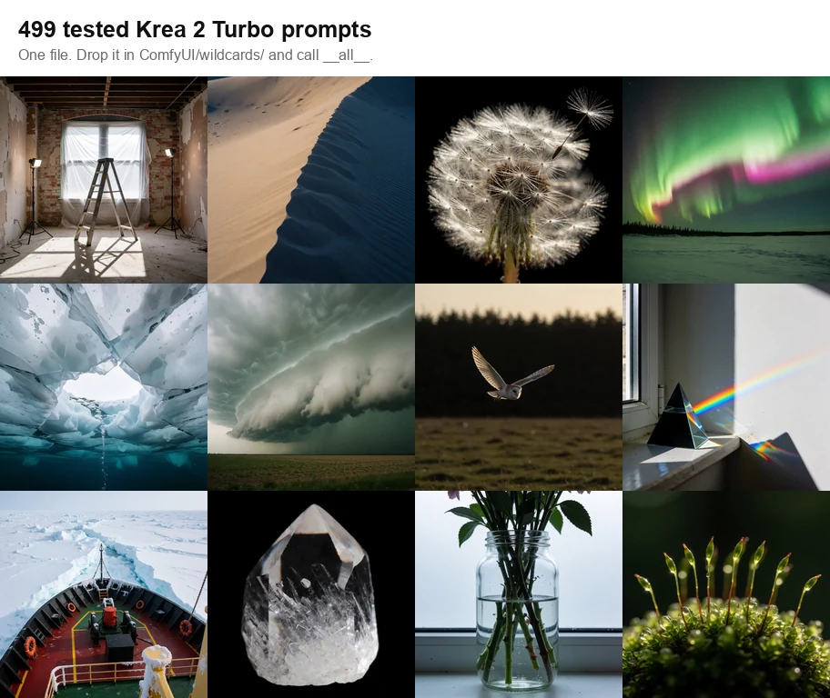

<h1 align="center">krea2-wildcards</h1>

Krea 2 Turbo プロンプト 475 件、それぞれ生成された画像つき。押せばコピー。

  

<a href="README.md">EN</a> · <a href="README_ZH.md">ZH</a> · <a href="README_KO.md">KO</a> · <a href="README_ES.md">ES</a> · <a href="README_FR.md">FR</a> · <a href="README_DE.md">DE</a> · <a href="README_PT.md">PT</a> · <a href="https://sjh9714.github.io/krea2-wildcards/"><b>ギャラリーを見る →</b></a>

## 📋 1 つコピー

Open the [gallery](https://sjh9714.github.io/krea2-wildcards/), press **copy** under any picture, paste it wherever you generate. Nothing to install, no account, and the search box finds the ones you want.

<a href="https://sjh9714.github.io/krea2-wildcards/"><b>Open the gallery →</b></a>

## 📥 まとめて持っていく

**[Download all.txt](https://raw.githubusercontent.com/sjh9714/krea2-wildcards/main/wildcards/all.txt)** (104 KB), one prompt per line. Paste any of them into anything.

**[Download the wildcard zip](https://github.com/sjh9714/krea2-wildcards/releases/latest/download/krea2-wildcards.zip)** for all category files in one archive.

On ComfyUI you can wire it up instead: put [wildcards/](wildcards/) in `ComfyUI/wildcards/` and write `__all__` in a prompt. That needs a dynamic prompts node, which ComfyUI does not come with, so install [comfyui-dynamicprompts](https://github.com/adieyal/comfyui-dynamicprompts) first or the underscores end up in your picture.

## 🗂 カテゴリ

[photography](docs/gallery-part-1.md#photography) 18 · [typography](docs/gallery-part-1.md#typography) 15 · [product](docs/gallery-part-1.md#product) 18 · [illustration](docs/gallery-part-1.md#illustration) 18 · [reference-sheet](docs/gallery-part-1.md#reference-sheet) 1 · [isometric-3d](docs/gallery-part-1.md#isometric-3d) 10 · [editing](docs/gallery-part-1.md#editing) 5 · [portrait](docs/gallery-part-1.md#portrait) 8 · [infographic](docs/gallery-part-1.md#infographic) 8 · [collectible](docs/gallery-part-1.md#collectible) 5 · [stationery](docs/gallery-part-1.md#stationery) 6 · [food](docs/gallery-part-1.md#food) 9 · [interior](docs/gallery-part-1.md#interior) 10 · [pattern](docs/gallery-part-1.md#pattern) 8 · [brand-mark](docs/gallery-part-1.md#brand-mark) 7 · [miniature](docs/gallery-part-1.md#miniature) 8 · [coloring-page](docs/gallery-part-1.md#coloring-page) 6 · [ui](docs/gallery-part-1.md#ui) 1 · [stringcount](docs/gallery-part-1.md#stringcount) 8 · [animal](docs/gallery-part-1.md#animal) 10 · [landscape](docs/gallery-part-1.md#landscape) 10 · [fashion](docs/gallery-part-1.md#fashion) 7 · [automotive](docs/gallery-part-2.md#automotive) 7 · [exterior](docs/gallery-part-2.md#exterior) 8 · [abstract](docs/gallery-part-2.md#abstract) 7 · [objectcount](docs/gallery-part-2.md#objectcount) 7 · [monogram](docs/gallery-part-2.md#monogram) 2 · [poster](docs/gallery-part-2.md#poster) 9 · [still-life](docs/gallery-part-2.md#still-life) 8 · [macro-nature](docs/gallery-part-2.md#macro-nature) 8 · [street](docs/gallery-part-2.md#street) 8 · [night](docs/gallery-part-2.md#night) 7 · [respecify](docs/gallery-part-2.md#respecify) 2 · [hangul](docs/gallery-part-2.md#hangul) 4 · [sport](docs/gallery-part-2.md#sport) 6 · [scifi](docs/gallery-part-2.md#scifi) 8 · [underwater](docs/gallery-part-2.md#underwater) 8 · [aerial](docs/gallery-part-2.md#aerial) 3 · [period](docs/gallery-part-2.md#period) 8 · [jewellery](docs/gallery-part-2.md#jewellery) 8 · [fantasy](docs/gallery-part-2.md#fantasy) 9 · [comic](docs/gallery-part-2.md#comic) 7 · [childrens-book](docs/gallery-part-2.md#childrens-book) 8 · [technical-drawing](docs/gallery-part-2.md#technical-drawing) 8 · [vehicle](docs/gallery-part-2.md#vehicle) 10 · [weather](docs/gallery-part-2.md#weather) 8 · [glass](docs/gallery-part-2.md#glass) 8 · [material](docs/gallery-part-2.md#material) 5 · [crowd](docs/gallery-part-2.md#crowd) 8 · [weave](docs/gallery-part-2.md#weave) 7 · [tattoo](docs/gallery-part-2.md#tattoo) 7 · [pixel-art](docs/gallery-part-2.md#pixel-art) 7 · [anatomy](docs/gallery-part-3.md#anatomy) 8 · [sculpture](docs/gallery-part-3.md#sculpture) 8 · [plant](docs/gallery-part-3.md#plant) 10 · [tool](docs/gallery-part-3.md#tool) 8 · [knolling](docs/gallery-part-3.md#knolling) 5 · [silhouette](docs/gallery-part-3.md#silhouette) 7 · [mirror](docs/gallery-part-3.md#mirror) 7 · [mineral](docs/gallery-part-3.md#mineral) 8 · [seasonal](docs/gallery-part-3.md#seasonal) 8

What this model does and does not do, the 65 generations that were cut, how it was run and what the seeds are worth: **[FINDINGS.md](FINDINGS.md)** · [REPRODUCING.md](REPRODUCING.md) · [VOCABULARY.md](VOCABULARY.md) · [TEMPLATES.md](TEMPLATES.md) · [styles/](styles/README.md) · [comparison](docs/comparison.md) · [the cut generations](docs/gallery-failures.md)

## 🤝 コントリビュート

`prompts.json` にエントリを追加し、出力画像を添えて PR を送ってください。ルールは 2 つ、プロンプトは再現可能であること、画像は未編集の出力であることです。

## ⚖ ライセンス

プロンプトは MIT です。生成画像はモデル提供者の規約に従います。商用利用の前に確認してください。
