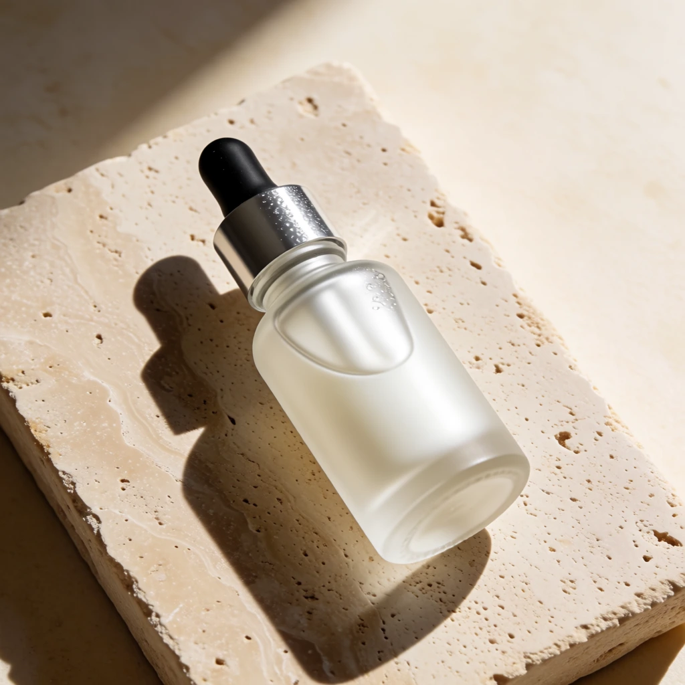
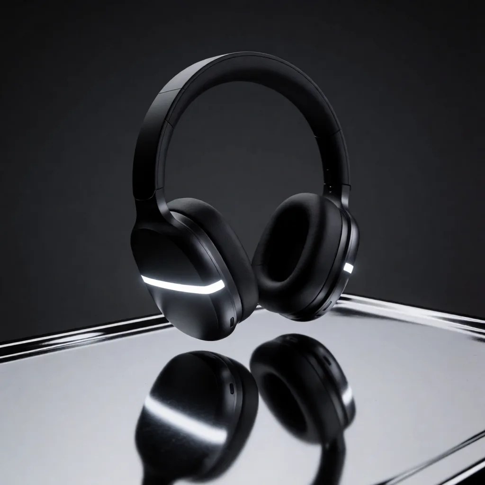
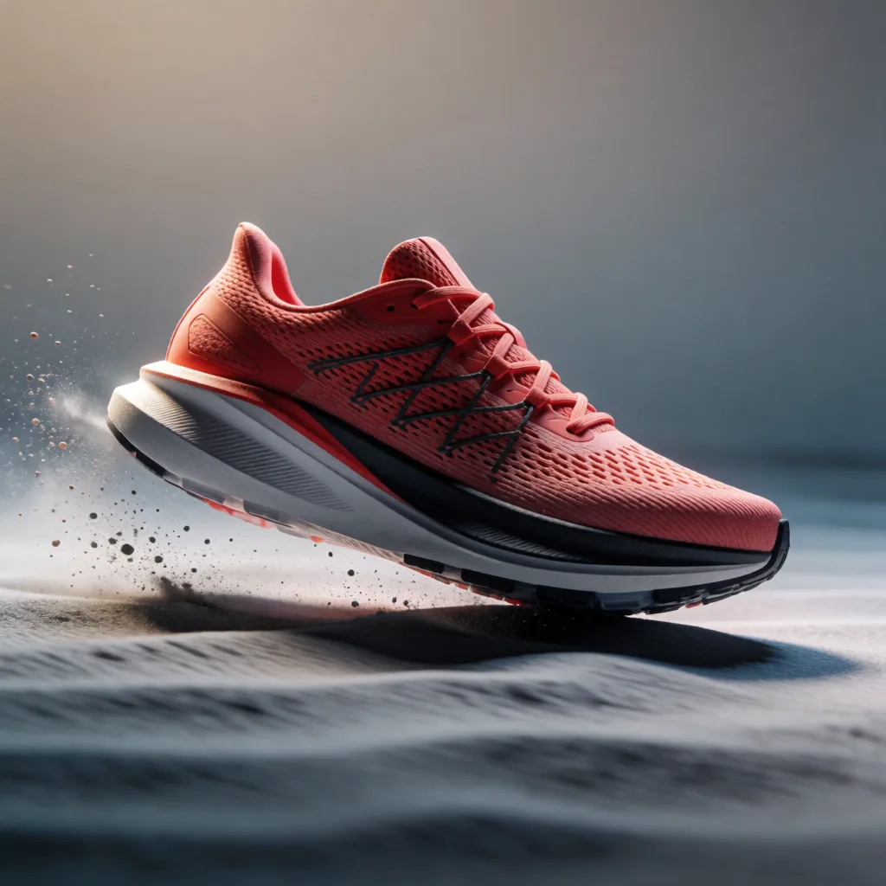
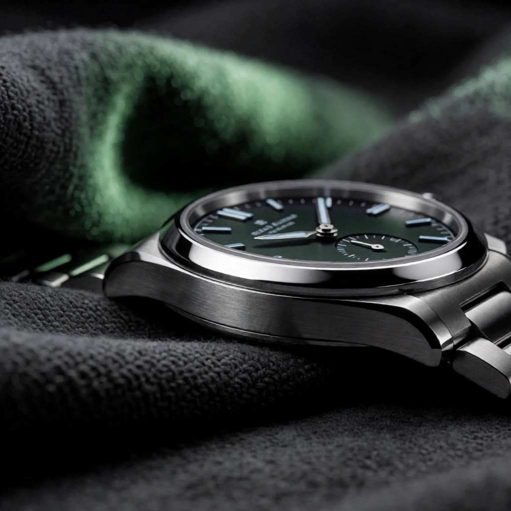
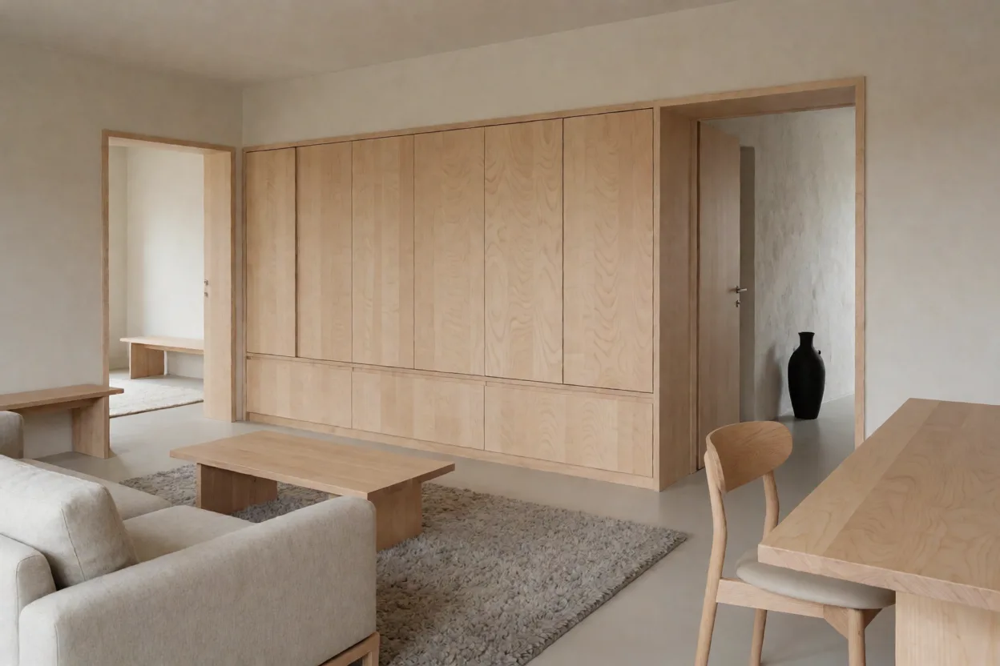
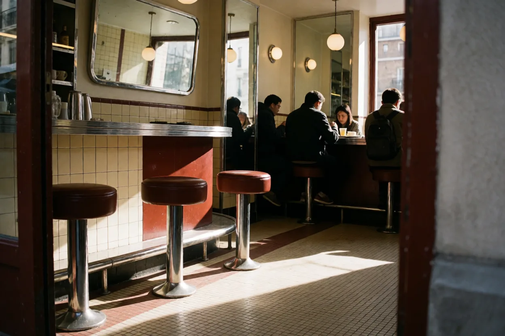
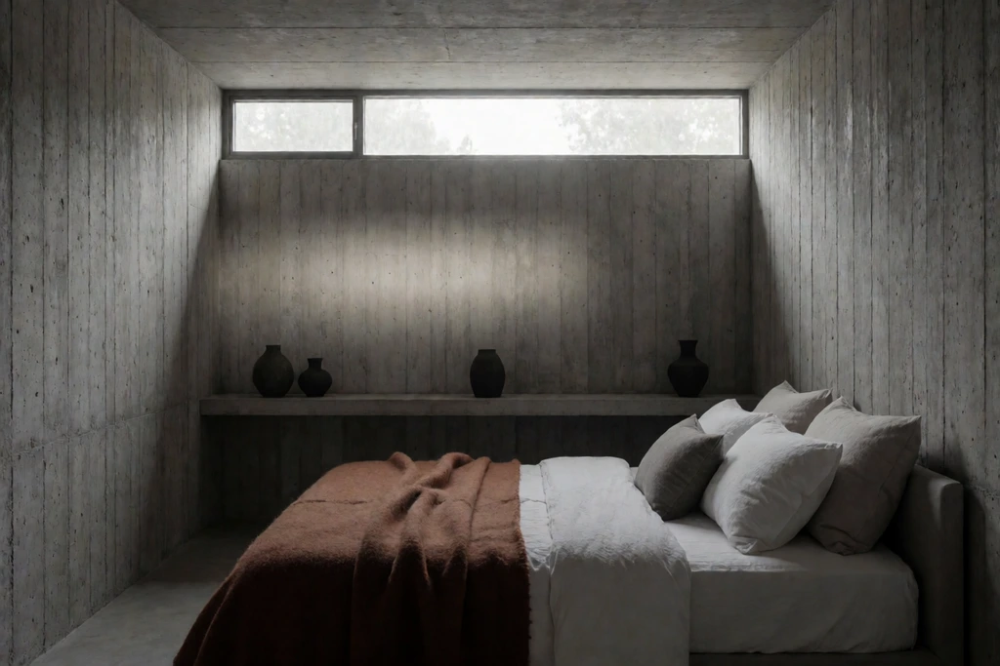
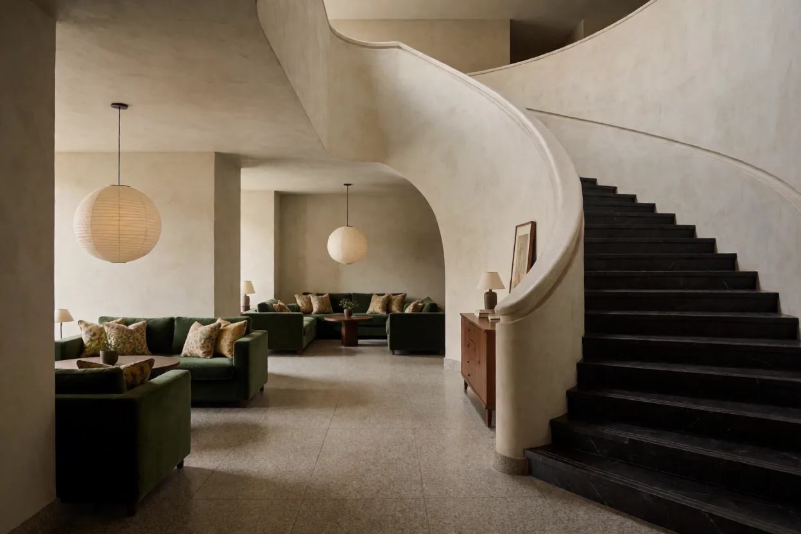
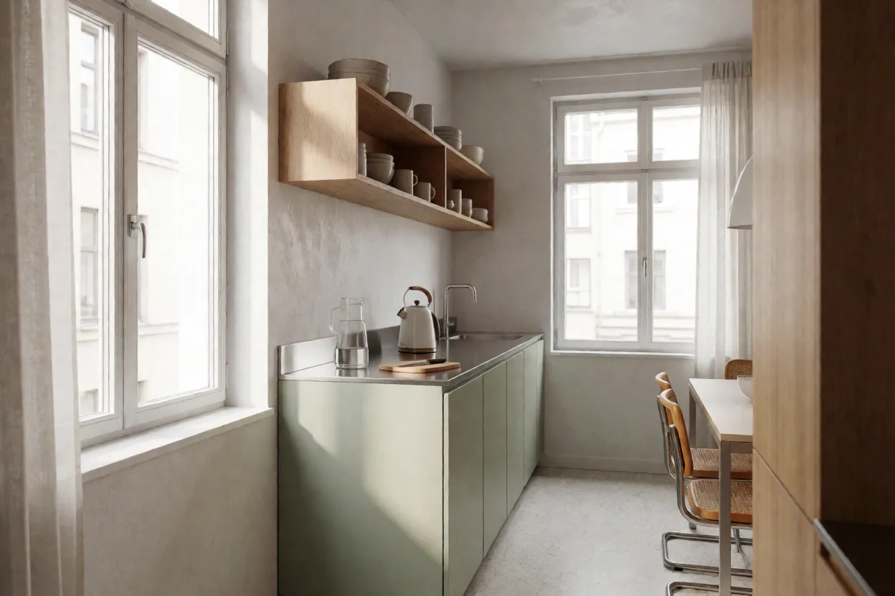

[← the categories](gallery.md)
## photography

_Photoreal scenes, lighting, lens behaviour, film stock_

### 1. Ceramicist at golden hour, 85mm


```text
A ceramicist in her studio at golden hour, hands wet with slip, throwing a bowl on a kick wheel. Shot on 85mm at f/1.8, shallow depth of field, warm rim light from a west-facing window, dust motes in the beam. Muted earth palette, visible clay dust on her forearms.
```

`seed: 1913817765` · `photography-001`

<sub>vocabulary: `85mm`, `muted`, `palette`, `shallow depth of field` · [what each one does](reference/VOCABULARY.md)</sub>

<sub>[back to the categories](gallery.md#categories)</sub>

### 2. Rain-soaked crosswalk, neon reflections


```text
A rain-soaked crosswalk at night in Seoul, seen from a low angle at pavement level. Neon signage reflected and broken across the wet asphalt, a single pedestrian mid-stride with an umbrella. 35mm, deep focus, high contrast, cyan and magenta cast against black.
```

`seed: 1037393037` · `photography-002`

<sub>vocabulary: `35mm`, `high contrast`, `low angle` · [what each one does](reference/VOCABULARY.md)</sub>

<sub>[back to the categories](gallery.md#categories)</sub>

### 3. Cold-lit surgical corridor


```text
An empty hospital corridor lit only by overhead fluorescents, one tube flickering. Polished linoleum reflecting the ceiling lights into long streaks. Symmetrical one-point perspective, 24mm, slight barrel distortion, desaturated green-grey palette, absolutely no people.
```

`seed: 306108529` · `photography-003`

<sub>vocabulary: `24mm`, `desaturated`, `fluorescent`, `overhead`, `palette`, `polished`, `symmetrical` · [what each one does](reference/VOCABULARY.md)</sub>

<sub>[back to the categories](gallery.md#categories)</sub>

### 4. Portra 400 family kitchen


```text
A cluttered family kitchen mid-morning, shot on Kodak Portra 400, slight grain and halation on the highlights. Steam from a kettle catching the window light, dishes stacked, a child's drawing taped to a cabinet. Natural skin tones, soft contrast, 50mm.
```

`seed: 1671971794` · `photography-004`

<sub>vocabulary: `50mm`, `grain`, `window light` · [what each one does](reference/VOCABULARY.md)</sub>

<sub>[back to the categories](gallery.md#categories)</sub>

### 5. Macro: solder joint


```text
Extreme macro of a hand-soldered joint on a green PCB, 5:1 magnification, focus stacked so the entire solder fillet is sharp. Visible flux residue, the silkscreen label R14 legible beside it. Cold ring light, shallow background falloff into black.
```

`seed: 1136909792` · `photography-005`

<sub>vocabulary: `macro` · [what each one does](reference/VOCABULARY.md)</sub>

<sub>[back to the categories](gallery.md#categories)</sub>

### 6. Overcast coastline, long exposure


```text
A basalt coastline under heavy overcast, 30-second long exposure so the surf becomes a low white mist around the rocks. Horizon dead level, no sun, 16mm, ND1000, cool grey palette with a single ochre patch of lichen in the foreground.
```

`seed: 589730875` · `photography-006`

<sub>vocabulary: `long exposure`, `palette` · [what each one does](reference/VOCABULARY.md)</sub>

<sub>[back to the categories](gallery.md#categories)</sub>

### 7. Backlit dust in a warehouse


```text
A disused warehouse interior, late afternoon sun entering through a high broken window as a hard visible shaft. Dust suspended in the beam, everything outside the beam falling to near-black. 35mm, heavy contrast, one strong light source only.
```

`seed: 1496444718` · `photography-007`

<sub>vocabulary: `35mm`, `light source` · [what each one does](reference/VOCABULARY.md)</sub>

<sub>[back to the categories](gallery.md#categories)</sub>

### 8. Flash-lit street portrait at night


```text
A street portrait at night, direct on-camera flash, subject one metre from the lens, background falling off to black within two metres. Harsh specular highlights on skin, red-eye avoided, 28mm, the raw snapshot aesthetic of 1990s tabloid photography.
```

`seed: 1204392285` · `photography-008`

<sub>[back to the categories](gallery.md#categories)</sub>

### 9. Aerial: terraced rice fields


```text
Directly overhead drone shot of terraced rice fields at flooding stage, water surfaces mirroring a pale sky so the terraces read as abstract silver contours. No horizon. Late afternoon, long shadows from the retaining walls, subtle green fringe of new growth.
```

`seed: 1726756617` · `photography-009`

<sub>vocabulary: `long shadow`, `overhead` · [what each one does](reference/VOCABULARY.md)</sub>

<sub>[back to the categories](gallery.md#categories)</sub>

### 10. Tungsten-lit diner booth


```text
A booth in an empty roadside diner at 2am, lit by warm tungsten pendants against cold blue exterior night through the window. Chrome napkin dispenser catching both colour temperatures. 40mm, slight vignette, colour contrast between the two light sources is the subject.
```

`seed: 1590663786` · `photography-010`

<sub>vocabulary: `light source`, `tungsten` · [what each one does](reference/VOCABULARY.md)</sub>

<sub>[back to the categories](gallery.md#categories)</sub>

### 11. Fog bank on a suspension bridge


```text
The upper cables of a suspension bridge disappearing into a fog bank, shot from the deck with a 200mm lens so the towers compress into flat silhouetted layers. Visibility drops to nothing by the second tower. Cool grey monochrome broken only by one amber sodium lamp.
```

`seed: 1647355798` · `photography-011`

<sub>vocabulary: `monochrome` · [what each one does](reference/VOCABULARY.md)</sub>

<sub>[back to the categories](gallery.md#categories)</sub>

### 12. Window seat, altitude


```text
From an aircraft window at cruising altitude: the wing's trailing edge in the lower third, a solid deck of cloud below, and the curvature of the horizon under a gradient from pale gold to deep indigo. Slight scratches and haze in the acrylic pane, deliberately not corrected.
```

`seed: 849986701` · `photography-012`

<sub>[back to the categories](gallery.md#categories)</sub>

### 13. Sauna interior, steam


```text
A cedar sauna interior lit by one small high window, steam rolling off the stove rocks and catching the light. Wet benches, condensation running down the wall boards. 24mm, warm brown palette, the air itself is the subject.
```

`seed: 1447903387` · `photography-013`

<sub>vocabulary: `24mm`, `palette` · [what each one does](reference/VOCABULARY.md)</sub>

<sub>[back to the categories](gallery.md#categories)</sub>

### 14. Night market, tungsten and smoke


```text
A night market food stall shot from across the aisle, tungsten bulbs overhead, smoke from a griddle drifting through the light. Vendor mid-motion so the hands blur while the stall stays sharp. 35mm, 1/15s, handheld.
```

`seed: 860958653` · `photography-014`

<sub>vocabulary: `35mm`, `overhead`, `tungsten` · [what each one does](reference/VOCABULARY.md)</sub>

<sub>[back to the categories](gallery.md#categories)</sub>

### 15. Frost on single-glazed glass


```text
Macro of frost crystals on the inside of a single-glazed window at dawn, backlit by low sun so each dendrite glows. Focus falls off within a centimetre. Blue shadow tones against a warm bloom, no other subject.
```

`seed: 1223022199` · `photography-015`

<sub>vocabulary: `backlit`, `macro` · [what each one does](reference/VOCABULARY.md)</sub>

<sub>[back to the categories](gallery.md#categories)</sub>

### 16. Empty swimming pool, drained


```text
A drained municipal swimming pool photographed from the deep end floor looking up at the diving board. Cracked blue paint, leaf litter in the corners, harsh midday sun cutting a hard diagonal across the tiled wall. 20mm, exaggerated verticals.
```

`seed: 1658386034` · `photography-016`

<sub>[back to the categories](gallery.md#categories)</sub>

### 17. Workshop hands, no face


```text
Close crop of a woodworker's hands setting a hand plane on a bench, wrist and forearm only, no face in frame. Shavings curling from the mouth of the plane. Soft north light, 60mm macro, shallow focus on the blade edge.
```

`seed: 1007639879` · `photography-017`

<sub>vocabulary: `macro`, `shallow focus` · [what each one does](reference/VOCABULARY.md)</sub>

<sub>[back to the categories](gallery.md#categories)</sub>

### 18. Motorway at dusk, long lens


```text
A motorway interchange shot from an overpass with a 400mm lens at dusk, headlight and taillight streams compressed into stacked ribbons of white and red. Traffic and infrastructure become pure horizontal bands. 8-second exposure, no sky visible.
```

`seed: 1873728665` · `photography-018`

<sub>[back to the categories](gallery.md#categories)</sub>

## typography

_Short-string text rendering. Krea 2 holds a single sign or label at any length, including an eight-word plaque, but degrades once several independent strings or a paragraph share the frame._

### 1. Enamel pin packaging


```text
Retail backing card for an enamel pin, photographed flat. The card reads "NIGHT SHIFT" in a condensed grotesque at the top and "limited to 200" in small caps at the bottom. Riso-style two-colour print, fluorescent orange and navy, visible paper tooth and slight misregistration.
```

`seed: 333206637` · `typography-003`

<sub>vocabulary: `fluorescent` · [what each one does](reference/VOCABULARY.md)</sub>

<sub>[back to the categories](gallery.md#categories)</sub>

### 2. Letterpress business card, macro


```text
Macro of a letterpress business card on cotton stock, raking light from the left so the deep impression casts visible shadows in the counters. The card reads "HOLLOW & SON — MILLWRIGHTS — EST 1908" in a small caps serif. Single ink colour, deep indigo, generous letterspacing.
```

`seed: 1431711597` · `typography-008`

<sub>vocabulary: `letterpress`, `macro`, `raking light` · [what each one does](reference/VOCABULARY.md)</sub>

<sub>[back to the categories](gallery.md#categories)</sub>

### 3. Stencilled crate marking


```text
A wooden shipping crate photographed straight on, stencilled in black spray paint with exactly "FRAGILE" above "THIS WAY UP". Paint has bled slightly through the stencil edges. Weathered pine, raking side light.
```

`seed: 1101869585` · `typography-011`

<sub>vocabulary: `side light`, `weathered` · [what each one does](reference/VOCABULARY.md)</sub>

<sub>[back to the categories](gallery.md#categories)</sub>

### 4. Enamel station sign


```text
A vitreous enamel railway platform sign on a brick wall, dark blue ground with white letters reading exactly "PLATFORM 4". Chipped at one corner exposing the steel. Straight-on, overcast light.
```

`seed: 1556240670` · `typography-012`

<sub>vocabulary: `overcast light` · [what each one does](reference/VOCABULARY.md)</sub>

<sub>[back to the categories](gallery.md#categories)</sub>

### 5. Embroidered cap


```text
Macro of a canvas cap's front panel with "NORTH YARD" embroidered in cream chain-stitch on olive twill. Visible thread texture and slight puckering of the fabric under the stitching.
```

`seed: 1864240842` · `typography-013`

<sub>vocabulary: `macro` · [what each one does](reference/VOCABULARY.md)</sub>

<sub>[back to the categories](gallery.md#categories)</sub>

### 6. Neon, one word


```text
A single neon sign on a brick wall at dusk reading exactly "OPEN" in cursive rose-pink tube, visible glass path and mounting standoffs, pink spill on the brick. One segment dark.
```

`seed: 235613196` · `typography-014`

<sub>[back to the categories](gallery.md#categories)</sub>

### 7. Hot-foil business card


```text
Macro of a black cotton business card with "MERIDIAN" hot-foil stamped in copper, raking light catching the foil. No other text. Shallow depth of field.
```

`seed: 2040305462` · `typography-015`

<sub>vocabulary: `macro`, `raking light`, `shallow depth of field` · [what each one does](reference/VOCABULARY.md)</sub>

<sub>[back to the categories](gallery.md#categories)</sub>

### 8. Chalk price tag


```text
A small slate price tag propped in a bakery basket, hand-chalked with exactly "SOURDOUGH" and "£4.20" beneath it. Warm morning light, shallow focus, flour dust on the slate.
```

`seed: 1659883` · `typography-016`

<sub>vocabulary: `shallow focus` · [what each one does](reference/VOCABULARY.md)</sub>

<sub>[back to the categories](gallery.md#categories)</sub>

### 9. Painted boat transom


```text
The transom of a wooden fishing boat, hand-painted in white serif capitals reading exactly "MARY ANNE". Green hull, salt-weathered paint, waterline just visible. Straight-on documentary framing.
```

`seed: 375084430` · `typography-017`

<sub>vocabulary: `weathered` · [what each one does](reference/VOCABULARY.md)</sub>

<sub>[back to the categories](gallery.md#categories)</sub>

### 10. Letterpress poster, two words


```text
A letterpress poster on cotton paper reading exactly "KEEP GOING" in wood type, deep impression visible under raking light, single ink colour oxblood, generous margins, no other elements.
```

`seed: 833951684` · `typography-018`

<sub>vocabulary: `letterpress`, `raking light` · [what each one does](reference/VOCABULARY.md)</sub>

<sub>[back to the categories](gallery.md#categories)</sub>

### 11. Machine-shop door


```text
A steel workshop door with an aluminium plate riveted at eye level, engraved "TOOL ROOM" in machine-cut capitals filled with black paint. Scuffed metal, industrial lighting.
```

`seed: 984217211` · `typography-019`

<sub>vocabulary: `engraved` · [what each one does](reference/VOCABULARY.md)</sub>

<sub>[back to the categories](gallery.md#categories)</sub>

### 12. Airport gate display


```text
A split-flap departure board close-up showing a single row reading exactly "SEOUL" and "GATE 12". Mechanical flaps mid-settle on one character. Warm indicator lighting, shallow depth.
```

`seed: 1590119155` · `typography-020`

<sub>vocabulary: `close-up` · [what each one does](reference/VOCABULARY.md)</sub>

<sub>[back to the categories](gallery.md#categories)</sub>

### 13. Fire door sign


```text
A steel fire door with a rectangular sign at eye level reading exactly "FIRE EXIT" in white on green, small running-figure pictogram beside the text. Scuffed paint, institutional corridor lighting, straight-on.
```

`seed: 2060170403` · `typography-021`

<sub>[back to the categories](gallery.md#categories)</sub>

### 14. Engraved brass plaque


```text
A small brass plaque screwed to a stone wall, engraved and blacked with exactly "EST 1884". Patina in the letter recesses, raking afternoon light, shallow depth of field.
```

`seed: 425919870` · `typography-022`

<sub>vocabulary: `engraved`, `patina`, `shallow depth of field` · [what each one does](reference/VOCABULARY.md)</sub>

<sub>[back to the categories](gallery.md#categories)</sub>

### 15. Tin sign, two words


```text
A weathered enamel tin sign nailed to a barn wall reading exactly "FRESH EGGS" in hand-painted red capitals on cream. Rust bleeding from two nail heads, overcast light, straight-on documentary framing.
```

`seed: 722835994` · `typography-023`

<sub>vocabulary: `overcast light`, `weathered` · [what each one does](reference/VOCABULARY.md)</sub>

<sub>[back to the categories](gallery.md#categories)</sub>

## product

_Products shown as clean hero images, studio still lifes, and campaign-ready details_

### 1. Perfume bottle, hard light


```text
A faceted glass perfume bottle on a polished black surface, single hard key light from upper left creating one crisp specular edge down the bottle's spine and a sharp reflection beneath. Deep shadow elsewhere. No label. Product photography, 100mm macro, f/11.
```

`seed: 524883984` · `product-001`

<sub>vocabulary: `macro`, `polished` · [what each one does](reference/VOCABULARY.md)</sub>

<sub>[back to the categories](gallery.md#categories)</sub>

### 2. Coffee bag, in-context


```text
A kraft coffee bag with a matte white label standing on a scratched steel countertop in a working roastery, bokeh of roasting drums behind. Natural window light from camera left. The bag looks used, one corner folded and clipped. Editorial rather than studio.
```

`seed: 98544605` · `product-002`

<sub>vocabulary: `matte`, `window light` · [what each one does](reference/VOCABULARY.md)</sub>

<sub>[back to the categories](gallery.md#categories)</sub>

### 3. Mechanical keyboard, top-down


```text
Top-down flat lay of an aluminium 65% mechanical keyboard on a grey desk mat, keycaps in beige and slate with one red escape key. Even diffuse light, no hotspots, every legend crisp and readable. Coiled aviator cable arranged in a loose S to the upper right.
```

`seed: 1919442279` · `product-003`

<sub>vocabulary: `flat lay`, `top-down` · [what each one does](reference/VOCABULARY.md)</sub>

<sub>[back to the categories](gallery.md#categories)</sub>

### 4. Skincare on wet stone


```text
A frosted glass dropper bottle resting on a wet slate slab, water beading and running off the edge. Cool north light, soft gradient background from pale grey to white. A single eucalyptus leaf, slightly out of focus, in the lower right. Clean, cold, clinical.
```

`seed: 2048927115` · `product-004`

<sub>vocabulary: `frosted` · [what each one does](reference/VOCABULARY.md)</sub>

<sub>[back to the categories](gallery.md#categories)</sub>

### 5. Sneaker, floating explode


```text
A running shoe photographed against seamless light grey with its components separated and suspended in an exploded view — outsole, midsole, upper, laces, insole — each layer held apart with even spacing. Soft top light, consistent shadows implying a single source, technical and legible.
```

`seed: 700222067` · `product-005`

<sub>vocabulary: `exploded`, `seamless` · [what each one does](reference/VOCABULARY.md)</sub>

<sub>[back to the categories](gallery.md#categories)</sub>

### 6. Watch macro, brushed steel


```text
Macro of a brushed steel dive watch bezel and crown, focus stacked so the knurling on the crown and the brushing grain on the case are both sharp. Controlled reflection strip along the polished chamfer. Dark grey background, no logo visible.
```

`seed: 1367506460` · `product-006`

<sub>vocabulary: `grain`, `macro`, `polished` · [what each one does](reference/VOCABULARY.md)</sub>

<sub>[back to the categories](gallery.md#categories)</sub>

### 7. Cast iron pan, overhead with food


```text
Overhead of a seasoned cast iron skillet on a scorched linen cloth, containing a half-eaten galette with visible flaking layers. Crumbs on the cloth. Directional afternoon light from the top of frame with real falloff toward the bottom. Nothing styled to perfection.
```

`seed: 2127336597` · `product-007`

<sub>vocabulary: `overhead` · [what each one does](reference/VOCABULARY.md)</sub>

<sub>[back to the categories](gallery.md#categories)</sub>

### 8. Cable and connector detail


```text
A braided USB-C cable coiled loosely on a white acrylic surface, one connector standing upright and in focus showing the moulded strain relief and contacts. Bright even light, faint shadow, the coil falling out of focus behind. Catalogue clarity.
```

`seed: 2081046429` · `product-008`

<sub>vocabulary: `even light` · [what each one does](reference/VOCABULARY.md)</sub>

<sub>[back to the categories](gallery.md#categories)</sub>

### 9. Ceramic mug, steam


```text
A speckled stoneware mug of black coffee on a pale oak table, backlit so the rising steam is clearly visible against a dark background. Reactive glaze pooling at the base. The steam is the hero — it must read as real vapour, not smoke.
```

`seed: 130047460` · `product-009`

<sub>vocabulary: `backlit` · [what each one does](reference/VOCABULARY.md)</sub>

<sub>[back to the categories](gallery.md#categories)</sub>

### 10. Packaging flat lay, unboxed


```text
An unboxed product flat lay: rigid box lid to the left, tissue paper unfolded, a small booklet, and the product itself centre right. Shot from directly overhead on a warm grey backdrop, soft shadowless light, elements aligned to an invisible grid with generous negative space.
```

`seed: 1260154266` · `product-010`

<sub>vocabulary: `flat lay`, `overhead`, `warm grey` · [what each one does](reference/VOCABULARY.md)</sub>

<sub>[back to the categories](gallery.md#categories)</sub>

### 11. Vinyl record and sleeve


```text
A vinyl record half-withdrawn from its sleeve on a walnut surface, raking light picking out the groove texture and one fingerprint on the run-out. Sleeve plain matte black, no artwork. 50mm, single softbox from the left, deep falloff to the right.
```

`seed: 1427728813` · `product-011`

<sub>vocabulary: `50mm`, `matte`, `raking light` · [what each one does](reference/VOCABULARY.md)</sub>

<sub>[back to the categories](gallery.md#categories)</sub>

### 12. Fountain pen nib, extreme macro


```text
Extreme macro of a fountain pen nib, focus stacked so the tipping material, the slit and the breather hole are all sharp. Ink residue in the feed channels. Dark field lighting so the steel reads as bright edges against black.
```

`seed: 2063722228` · `product-012`

<sub>vocabulary: `macro` · [what each one does](reference/VOCABULARY.md)</sub>

<sub>[back to the categories](gallery.md#categories)</sub>

### 13. Climbing shoe, worn


```text
A single well-worn climbing shoe on raw concrete, rubber scuffed through at the toe, laces frayed. Hard overhead light casting a tight shadow. Nothing styled — the wear is the subject. 85mm, f/8.
```

`seed: 1309089861` · `product-013`

<sub>vocabulary: `85mm`, `overhead`, `worn` · [what each one does](reference/VOCABULARY.md)</sub>

<sub>[back to the categories](gallery.md#categories)</sub>

### 14. Glassware set, backlit


```text
Three drinking glasses of graduated height on a white acrylic surface, backlit so the walls read as bright rims and the bases as dense caustics. No labels, no reflections of the studio. Perfectly level camera, clinical.
```

`seed: 329967531` · `product-014`

<sub>vocabulary: `backlit` · [what each one does](reference/VOCABULARY.md)</sub>

<sub>[back to the categories](gallery.md#categories)</sub>

### 15. Leather satchel, texture


```text
A tan leather satchel on a linen backdrop, side-lit to bring out the grain, stitch holes and the darkening around the buckle where it is handled. Slight sag in the flap from real use. 90mm macro, f/5.6.
```

`seed: 2115381394` · `product-015`

<sub>vocabulary: `grain`, `macro` · [what each one does](reference/VOCABULARY.md)</sub>

<sub>[back to the categories](gallery.md#categories)</sub>

### 16. Espresso tamper on grounds


```text
A stainless espresso tamper resting on a bed of fresh grounds in a portafilter, top-down, single hard light from the upper right. Grounds crisp enough to read individual particles at the edge of the puck.
```

`seed: 987689524` · `product-016`

<sub>vocabulary: `hard light`, `top-down` · [what each one does](reference/VOCABULARY.md)</sub>

<sub>[back to the categories](gallery.md#categories)</sub>

### 17. Wool swatch stack


```text
A stack of eight folded wool fabric swatches in muted heather tones, shot from a low three-quarter angle so the stack reads as bands of colour and texture. Soft even light, no shadow drama, catalogue clarity.
```

`seed: 1858895601` · `product-017`

<sub>vocabulary: `muted`, `soft even light`, `three-quarter` · [what each one does](reference/VOCABULARY.md)</sub>

<sub>[back to the categories](gallery.md#categories)</sub>

### 18. Bike drivetrain, dirty


```text
A road bike's rear cassette and derailleur photographed side-on, chain grimy with real road dirt, one cog catching a highlight. Garage light, unglamorous, mechanical honesty. 100mm macro, f/6.3.
```

`seed: 1450341996` · `product-018`

<sub>vocabulary: `macro` · [what each one does](reference/VOCABULARY.md)</sub>

<sub>[back to the categories](gallery.md#categories)</sub>

### 19. Frosted serum on travertine



```text
Premium skincare serum product photograph, one frosted glass dropper bottle without readable text on a warm travertine block, three-quarter hero angle, hard morning sunlight casting a clean diagonal shadow, pale sand backdrop, tiny condensation beads, crisp commercial retouching.
```

`Krea asset: 8cb14e75-77dc-479c-93ed-cc46a5f9edd4` · `aspect: 1:1` · `product-019`

<sub>vocabulary: `frosted`, `three-quarter` · [what each one does](reference/VOCABULARY.md)</sub>

<sub>[back to the categories](gallery.md#categories)</sub>

### 20. Headphones over polished chrome



```text
Matte black over-ear headphones suspended just above a polished chrome surface, front three-quarter product view, two narrow white strip lights defining the earcups, deep charcoal studio background, precise reflections, premium technology campaign, no text or extra objects.
```

`Krea asset: 31279c4e-1b11-4bca-a797-247aee1d096a` · `aspect: 1:1` · `product-020`

<sub>vocabulary: `matte`, `polished`, `three-quarter` · [what each one does](reference/VOCABULARY.md)</sub>

<sub>[back to the categories](gallery.md#categories)</sub>

### 21. Coral performance running shoe



```text
Single coral-red performance running shoe in a dynamic side profile on a softly rippled grey surface, small dust particles kicked up behind the heel, hard rim light and large soft key, visible mesh and foam texture, energetic sports advertising image, no logos or text.
```

`Krea asset: 13d51978-d404-44a1-b622-4f3df6885cfb` · `aspect: 1:1` · `product-021`

<sub>[back to the categories](gallery.md#categories)</sub>

### 22. Green-dial steel watch



```text
Luxury wristwatch macro product photograph, brushed steel case and dark green dial resting on folded charcoal fabric, low three-quarter angle, controlled pin highlights tracing the bezel, deep soft shadows, 100mm macro lens, sharp material detail, understated horology campaign.
```

`Krea asset: 2c38e709-cfd8-4cc2-a737-0963d1610d4e` · `aspect: 1:1` · `product-022`

<sub>vocabulary: `macro`, `soft shadow`, `three-quarter` · [what each one does](reference/VOCABULARY.md)</sub>

<sub>[back to the categories](gallery.md#categories)</sub>

## illustration

_Stylised, painterly, editorial_

### 1. Editorial: burnout


```text
An editorial illustration for an article on developer burnout. A figure at a desk rendered as a slowly unravelling ball of yarn, the loose thread running off the desk and out of frame. Limited palette: ink black, bone white, one dusty coral. Textured screenprint grain, generous negative space.
```

`seed: 1809538529` · `illustration-001`

<sub>vocabulary: `grain`, `limited palette` · [what each one does](reference/VOCABULARY.md)</sub>

<sub>[back to the categories](gallery.md#categories)</sub>

### 2. Gouache mountain hut


```text
A small stone hut on an alpine ridge at dusk, painted in gouache with visible brush texture and slightly chalky opacity. Cool blue snow shadows against a warm ochre sky. Simplified shapes, no outlines, hard edges where the paint has dried in layers.
```

`seed: 989989533` · `illustration-002`

<sub>vocabulary: `gouache` · [what each one does](reference/VOCABULARY.md)</sub>

<sub>[back to the categories](gallery.md#categories)</sub>

### 3. Ligne claire street scene


```text
A European city street in ligne claire style — uniform black contour lines of even weight, flat unmodulated colour fills, no hatching or gradients. A cyclist passing a bakery, a cat on a windowsill. Clear midday light implied purely through colour choice, not shading.
```

`seed: 193829588` · `illustration-003`

<sub>[back to the categories](gallery.md#categories)</sub>

### 4. Woodblock wave study


```text
A single breaking wave in the manner of a Japanese woodblock print: flat colour fields, keyblock outlines, visible wood grain texture in the sky area, deliberate slight misregistration of the blue plate. Indigo, pale sand, off-white paper tone. No figures.
```

`seed: 2141994631` · `illustration-004`

<sub>vocabulary: `grain` · [what each one does](reference/VOCABULARY.md)</sub>

<sub>[back to the categories](gallery.md#categories)</sub>

### 5. Technical cutaway, hand-drawn


```text
A hand-drawn technical cutaway of a mechanical wristwatch movement, ink line with light watercolour wash, leader lines pointing to unlabelled callout circles. Slightly imperfect linework showing it was drawn by hand. Warm paper tone, sepia ink.
```

`seed: 711741992` · `illustration-005`

<sub>vocabulary: `cutaway`, `watercolour` · [what each one does](reference/VOCABULARY.md)</sub>

<sub>[back to the categories](gallery.md#categories)</sub>

### 6. Risograph two-colour poster


```text
A two-colour risograph poster of a lone figure walking a dog across a wide empty field. Fluorescent pink and teal only, overprint where they cross producing a muddy third tone. Visible paper grain, roller streaks, 2mm misregistration on the teal layer.
```

`seed: 1958333047` · `illustration-006`

<sub>vocabulary: `fluorescent`, `grain`, `risograph` · [what each one does](reference/VOCABULARY.md)</sub>

<sub>[back to the categories](gallery.md#categories)</sub>

### 7. Children's book interior


```text
An interior spread from a children's picture book: a badger in a knitted scarf reading by lamplight in a burrow, roots visible through the earth walls. Soft coloured pencil texture, warm palette, no harsh outlines, plenty of quiet space in the composition.
```

`seed: 437733224` · `illustration-007`

<sub>vocabulary: `palette` · [what each one does](reference/VOCABULARY.md)</sub>

<sub>[back to the categories](gallery.md#categories)</sub>

### 8. Brutalist architecture, ink


```text
An ink drawing of a brutalist concrete community centre, cross-hatched shading only, no grey wash. Heavy contrast between lit and shadowed planes achieved entirely through hatch density. Slight wobble in the straight lines betraying a human hand.
```

`seed: 1322534157` · `illustration-008`

<sub>[back to the categories](gallery.md#categories)</sub>

### 9. Botanical plate


```text
A scientific botanical plate of a fig branch: full branch centre, with a dissected fruit cross-section and a single leaf detail arranged around it. Fine stippled shading, muted natural colour, aged cream paper, small unobtrusive numbered labels.
```

`seed: 1395552785` · `illustration-009`

<sub>vocabulary: `muted` · [what each one does](reference/VOCABULARY.md)</sub>

<sub>[back to the categories](gallery.md#categories)</sub>

### 10. Noir spot illustration


```text
A small spot illustration in high-contrast black and white: a hand pushing open a frosted glass office door, silhouetted venetian blind shadows falling across it. Pure black and pure white only, no midtones, shapes reading instantly at thumbnail size.
```

`seed: 662846866` · `illustration-010`

<sub>vocabulary: `frosted` · [what each one does](reference/VOCABULARY.md)</sub>

<sub>[back to the categories](gallery.md#categories)</sub>

### 11. Editorial: the commute


```text
An editorial illustration about commuting: a figure rendered as a folded paper boat drifting down a river of grey office windows. Two colours plus black, screenprint grain, large areas of untouched paper.
```

`seed: 971992746` · `illustration-011`

<sub>vocabulary: `grain` · [what each one does](reference/VOCABULARY.md)</sub>

<sub>[back to the categories](gallery.md#categories)</sub>

### 12. Cyanotype fern


```text
A single fern frond in the manner of a cyanotype photogram — Prussian blue ground, the frond rendered as a soft white silhouette with slight halation at the edges. Uneven wash and paper texture visible.
```

`seed: 403745806` · `illustration-012`

<sub>vocabulary: `cyanotype`, `silhouette` · [what each one does](reference/VOCABULARY.md)</sub>

<sub>[back to the categories](gallery.md#categories)</sub>

### 13. Scratchboard owl


```text
A barn owl rendered in scratchboard: white lines carved from solid black, feather detail built entirely from directional scratches of varying density. No grey, no colour, high drama.
```

`seed: 94561777` · `illustration-013`

<sub>[back to the categories](gallery.md#categories)</sub>

### 14. Isotype-style pictogram set


```text
A set of nine pictograms in the Isotype tradition arranged in a grid: figures, vehicles and buildings reduced to flat black silhouettes with uniform stroke logic. No outlines, no detail, instantly legible at any size.
```

`seed: 1365362645` · `illustration-014`

<sub>vocabulary: `silhouette` · [what each one does](reference/VOCABULARY.md)</sub>

<sub>[back to the categories](gallery.md#categories)</sub>

### 15. Watercolour harbour, wet-in-wet


```text
A small harbour at low tide painted wet-in-wet so the sky and water bleed into each other with hard drying edges where the paint pooled. Boats reduced to a few loaded brushstrokes. Muted ochre and slate.
```

`seed: 1827344974` · `illustration-015`

<sub>vocabulary: `muted` · [what each one does](reference/VOCABULARY.md)</sub>

<sub>[back to the categories](gallery.md#categories)</sub>

### 16. Comic panel, chiaroscuro


```text
A single comic panel: a figure descending a stairwell lit by one bare bulb, drawn in heavy brush-and-ink chiaroscuro with large solid blacks and minimal hatching. No panel border, no text.
```

`seed: 235666898` · `illustration-016`

<sub>[back to the categories](gallery.md#categories)</sub>

### 17. Mid-century travel poster


```text
A mid-century travel poster for a fictional coastal town: flat colour blocks, simplified geometry, a lighthouse and cliff reduced to three shapes, screenprint texture and one warm accent against cool tones. No text.
```

`seed: 1377917160` · `illustration-017`

<sub>[back to the categories](gallery.md#categories)</sub>

### 18. Anatomical study, red chalk


```text
An anatomical study of a human hand in red chalk on toned paper, in the manner of a Renaissance sketchbook — construction lines left visible, several overlapping attempts at the thumb on the same sheet.
```

`seed: 221852696` · `illustration-018`

<sub>[back to the categories](gallery.md#categories)</sub>

## reference-sheet

_Character reference sheets and turnarounds_

### 1. Reference sheet, establishing


```text
Character reference sheet for a woman in her sixties: silver hair cut short, a small crescent scar above the right eyebrow, wire-frame glasses, a heavy navy fisherman's sweater. Three views on one sheet — front, three-quarter, profile — consistent proportions, neutral grey background, even light.
```

`seed: 1453254312` · `reference-sheet-001`

<sub>vocabulary: `even light`, `three-quarter` · [what each one does](reference/VOCABULARY.md)</sub>

> Generate this first and use it as the reference for character-002 through 005.

<sub>[back to the categories](gallery.md#categories)</sub>

## isometric-3d

_Isometric scenes, dioramas, game-ready assets_

### 1. Isometric repair shop


```text
A small isometric diorama of a bicycle repair shop with the front wall removed: workbench, wheel truing stand, parts bins, a bike upside down on a stand. True isometric projection with no perspective convergence, soft clay-render materials, single warm key light from upper left, floating on a plain background.
```

`seed: 1886079203` · `isometric-3d-001`

<sub>vocabulary: `isometric` · [what each one does](reference/VOCABULARY.md)</sub>

<sub>[back to the categories](gallery.md#categories)</sub>

### 2. Isometric server room


```text
Isometric cutaway of a small server room: two racks with visible cable management, an overhead cable tray, a floor-standing UPS, and a portable AC unit. Cool blue LED accents against neutral grey hardware. Clean edges, ambient occlusion in the corners, no text on the equipment.
```

`seed: 1075533955` · `isometric-3d-002`

<sub>vocabulary: `cutaway`, `isometric`, `overhead` · [what each one does](reference/VOCABULARY.md)</sub>

<sub>[back to the categories](gallery.md#categories)</sub>

### 3. Game asset, modular tiles


```text
A sheet of six modular isometric floor and wall tiles for a game: stone floor, cracked stone floor, wooden floor, plain wall, wall with a doorway, wall with a barred window. Consistent lighting angle and tile dimensions across all six so they tessellate. Flat background, evenly spaced grid.
```

`seed: 1357449396` · `isometric-3d-003`

<sub>vocabulary: `isometric` · [what each one does](reference/VOCABULARY.md)</sub>

<sub>[back to the categories](gallery.md#categories)</sub>

### 4. Low-poly island


```text
A low-poly floating island: faceted terrain with visible flat triangles, a single stylised pine, a waterfall spilling from the underside into nothing. Hard-edged shading with no smoothing, saturated but limited palette, three-quarter isometric view against a pale gradient.
```

`seed: 1882712822` · `isometric-3d-004`

<sub>vocabulary: `isometric`, `limited palette`, `three-quarter` · [what each one does](reference/VOCABULARY.md)</sub>

<sub>[back to the categories](gallery.md#categories)</sub>

### 5. Exploded isometric, camera


```text
An exploded isometric view of a 35mm film camera, components separated vertically along a single axis: body, lens elements, shutter assembly, film back, winding mechanism. Consistent spacing, thin grey guide lines connecting the parts, matte technical rendering.
```

`seed: 1583709833` · `isometric-3d-005`

<sub>vocabulary: `35mm`, `exploded`, `isometric`, `matte` · [what each one does](reference/VOCABULARY.md)</sub>

<sub>[back to the categories](gallery.md#categories)</sub>

### 6. Isometric coffee bar


```text
An isometric cutaway of a small coffee bar: espresso machine, grinder, pastry case, two stools and a back shelf of cups. True isometric with no perspective convergence, soft clay materials, single warm key from upper left, floating on a plain ground.
```

`seed: 882577384` · `isometric-3d-006`

<sub>vocabulary: `cutaway`, `isometric` · [what each one does](reference/VOCABULARY.md)</sub>

<sub>[back to the categories](gallery.md#categories)</sub>

### 7. Isometric printing workshop


```text
Isometric diorama of a letterpress workshop with the front wall removed: a platen press, type cases, an inking slab and drying racks with sheets hanging. Consistent 30-degree axes, matte materials, ambient occlusion in the corners.
```

`seed: 1975246446` · `isometric-3d-007`

<sub>vocabulary: `isometric`, `letterpress`, `matte` · [what each one does](reference/VOCABULARY.md)</sub>

<sub>[back to the categories](gallery.md#categories)</sub>

### 8. Low-poly desert canyon


```text
A low-poly desert canyon section: faceted rock strata in graduated ochre bands, a dry riverbed, two stylised saguaro. Hard-edged flat shading with no smoothing, three-quarter isometric against a pale gradient.
```

`seed: 1391597167` · `isometric-3d-008`

<sub>vocabulary: `isometric`, `three-quarter` · [what each one does](reference/VOCABULARY.md)</sub>

<sub>[back to the categories](gallery.md#categories)</sub>

### 9. Exploded isometric, bicycle hub


```text
An exploded isometric view of a bicycle rear hub, components separated along the axle: axle, bearings, freehub body, cassette spacer, end caps. Even spacing, thin grey guide lines, matte technical rendering, no text.
```

`seed: 226111579` · `isometric-3d-009`

<sub>vocabulary: `exploded`, `isometric`, `matte` · [what each one does](reference/VOCABULARY.md)</sub>

<sub>[back to the categories](gallery.md#categories)</sub>

### 10. Isometric rooftop garden


```text
Isometric rooftop garden: raised beds, a small greenhouse, water butt, folding chairs and a ventilation stack. Plants stylised as simple massed forms. Soft top light, gentle shadows, floating on a plain background.
```

`seed: 1496030377` · `isometric-3d-010`

<sub>vocabulary: `isometric` · [what each one does](reference/VOCABULARY.md)</sub>

<sub>[back to the categories](gallery.md#categories)</sub>

## editing

_Image-to-image edits whose source is another entry in this catalog_

### 1. Relight this coastline


```text
Relight this coastline: replace the flat overcast with hard low-angle late afternoon sun from frame right, casting long shadows across the basalt. Keep the rock placement, horizon line and framing identical.
```

`seed: 364022812` · image-to-image from **Overcast coastline, long exposure** · `strength: 0.55` · `editing-001`

<sub>vocabulary: `long shadow` · [what each one does](reference/VOCABULARY.md)</sub>

> Source is photography-006 in this repo, so the edit is reproducible from a clone.

<sub>[back to the categories](gallery.md#categories)</sub>

### 2. Keep this corridor's geometry and perspective exactly. Chang


```text
Keep this corridor's geometry and perspective exactly. Change only the time and mood: warm amber emergency lighting instead of cold fluorescents, one light source at the far end, everything nearer falling into shadow.
```

`seed: 1459264371` · image-to-image from **Cold-lit surgical corridor** · `strength: 0.5` · `editing-002`

<sub>vocabulary: `fluorescent`, `light source` · [what each one does](reference/VOCABULARY.md)</sub>

> Source is photography-003 in this repo, so the edit is reproducible from a clone.

<sub>[back to the categories](gallery.md#categories)</sub>

### 3. Re-render these terraced fields as a gouache painting with v


```text
Re-render these terraced fields as a gouache painting with visible brush texture and chalky opacity. Every terrace contour stays in exactly the same position; only the medium changes.
```

`seed: 583476278` · image-to-image from **Aerial: terraced rice fields** · `strength: 0.6` · `editing-003`

<sub>vocabulary: `gouache` · [what each one does](reference/VOCABULARY.md)</sub>

> Source is photography-009 in this repo, so the edit is reproducible from a clone.

<sub>[back to the categories](gallery.md#categories)</sub>

### 4. Recolour this woodblock wave to a dusk palette, deep violet


```text
Recolour this woodblock wave to a dusk palette — deep violet water, salmon sky, warm cream foam. Keep every keyblock outline and flat colour field boundary exactly where it is.
```

`seed: 2083277726` · image-to-image from **Woodblock wave study** · `strength: 0.55` · `editing-005`

<sub>vocabulary: `palette` · [what each one does](reference/VOCABULARY.md)</sub>

> Source is illustration-004 in this repo, so the edit is reproducible from a clone.

<sub>[back to the categories](gallery.md#categories)</sub>

### 5. Blueprint version of the exploded camera


```text
Re-render this exploded camera diagram as a cyanotype blueprint: white line work on Prussian blue, every component in exactly the same position and spacing.
```

`seed: 1652457598` · image-to-image from **Exploded isometric, camera** · `strength: 0.6` · `editing-008`

<sub>vocabulary: `cyanotype`, `exploded` · [what each one does](reference/VOCABULARY.md)</sub>

<sub>[back to the categories](gallery.md#categories)</sub>

## portrait

_Profile pictures and avatars, the single most requested category in every prompt catalog measured_

### 1. Window-light portrait, 85mm


```text
A portrait of a woman in her thirties beside a north-facing window, 85mm at f/1.8, soft directional daylight falling across one side of the face and the other dropping into gentle shadow. Natural skin texture with visible pores, no retouching, catchlight in both eyes. Charcoal wool sweater, plain warm grey wall behind, shallow depth of field.
```

`seed: 1613165866` · `portrait-001`

<sub>vocabulary: `85mm`, `shallow depth of field`, `warm grey` · [what each one does](reference/VOCABULARY.md)</sub>

<sub>[back to the categories](gallery.md#categories)</sub>

### 2. High-contrast studio, single hard light


```text
Studio portrait of a man in his forties, single hard light high and to camera left, deep shadow filling the right of the face, black seamless background. Sharp specular highlight on the cheekbone, close-cropped beard, direct eye contact with the lens. Medium format look, 110mm equivalent.
```

`seed: 1110166560` · `portrait-002`

<sub>vocabulary: `hard light`, `seamless` · [what each one does](reference/VOCABULARY.md)</sub>

<sub>[back to the categories](gallery.md#categories)</sub>

### 3. Golden hour backlit, rim light


```text
Backlit outdoor portrait at golden hour, sun directly behind the subject creating a bright rim along the hair and shoulders, face lifted by soft bounce. Warm haze, out-of-focus grass and fence line behind. Linen shirt, relaxed expression, 135mm compression, f/2.
```

`seed: 648134594` · `portrait-003`

<sub>vocabulary: `backlit` · [what each one does](reference/VOCABULARY.md)</sub>

<sub>[back to the categories](gallery.md#categories)</sub>

### 4. Overcast environmental portrait


```text
Environmental portrait of a woodworker standing in her shop doorway under flat overcast light, sawdust on a canvas apron, hands relaxed at her sides. The shop interior falls off into darkness behind her. 35mm, waist up, documentary framing with the doorframe as a natural border.
```

`seed: 1794897089` · `portrait-004`

<sub>vocabulary: `35mm`, `overcast light` · [what each one does](reference/VOCABULARY.md)</sub>

<sub>[back to the categories](gallery.md#categories)</sub>

### 5. Portra 400 candid, mixed indoor light


```text
Candid indoor portrait on Kodak Portra 400, a man laughing mid-conversation at a kitchen table, tungsten lamp warm on one side and cool window light on the other. Visible film grain, soft halation on the highlights, slightly warm cast. 50mm, handheld, not looking at the camera.
```

`seed: 1126231015` · `portrait-005`

<sub>vocabulary: `50mm`, `grain`, `tungsten`, `window light` · [what each one does](reference/VOCABULARY.md)</sub>

<sub>[back to the categories](gallery.md#categories)</sub>

### 6. Painterly oil portrait, chiaroscuro


```text
An oil painting portrait in the chiaroscuro tradition, three-quarter view, single warm light source from upper left, background falling to near black. Visible brushwork in the flesh tones, glazed shadows, muted earth palette of ochre, umber and lead white. Not photorealistic — the paint should be visible.
```

`seed: 1461986812` · `portrait-007`

<sub>vocabulary: `muted`, `palette`, `three-quarter`, `warm light` · [what each one does](reference/VOCABULARY.md)</sub>

<sub>[back to the categories](gallery.md#categories)</sub>

### 7. Black and white, harsh noon sun


```text
Black and white portrait shot in harsh overhead noon sun, deep shadows in the eye sockets and under the nose, strong contrast, grain pushed. Subject squinting slightly, sweat on the forehead, plain concrete wall behind. Tri-X pushed to 1600, 35mm.
```

`seed: 1915439531` · `portrait-009`

<sub>vocabulary: `35mm`, `grain`, `overhead` · [what each one does](reference/VOCABULARY.md)</sub>

<sub>[back to the categories](gallery.md#categories)</sub>

### 8. Charcoal drawing on toned paper


```text
A charcoal portrait drawn on mid-grey toned paper, white chalk for the highlights, compressed charcoal for the darks, the paper tone doing the mid-values. Loose hatching around the edges, tight rendering only around the eyes. Smudged, worked, visibly hand-made.
```

`seed: 121909817` · `portrait-011`

<sub>[back to the categories](gallery.md#categories)</sub>

## infographic

_Explainer layouts, quote cards, dashboards: text-heavy by design, which is where this model is weakest and most worth documenting_

### 1. Quote card with rule lines


```text
A minimal quote card layout: the words "MEASURE TWICE" set large in a condensed grotesque, a thin horizontal rule beneath, and "CUT ONCE" smaller and right-aligned below it. Cream background, near-black type, generous margins. Nothing else in the frame.
```

`seed: 662649445` · `infographic-001`

<sub>[back to the categories](gallery.md#categories)</sub>

### 2. Bento grid, four modules


```text
A bento-box dashboard layout with four rounded rectangular modules of different sizes on a soft grey background. Each module holds a simple abstract chart — one bar, one donut, one sparkline, one large number. Soft shadows, generous padding, one teal accent colour, no legible body text.
```

`seed: 1870145278` · `infographic-002`

<sub>vocabulary: `soft shadow` · [what each one does](reference/VOCABULARY.md)</sub>

<sub>[back to the categories](gallery.md#categories)</sub>

### 3. Cutaway diagram with leader lines


```text
A technical cutaway of a thermos flask, drawn as a clean line diagram with the interior layers visible, thin leader lines pointing out from four components to empty label positions at the edges. No text on the labels — just the lines and the dots. White background, single ink weight.
```

`seed: 2045906439` · `infographic-003`

<sub>vocabulary: `cutaway` · [what each one does](reference/VOCABULARY.md)</sub>

<sub>[back to the categories](gallery.md#categories)</sub>

### 4. Vintage patent drawing


```text
A vintage patent illustration of a folding bicycle, black ink line work on aged off-white paper, hatched shading, numbered reference marks beside the components, a ruled border around the sheet. Figure numbers only, no descriptive text. The aesthetic of a 1920s patent office filing.
```

`seed: 1151604106` · `infographic-005`

<sub>[back to the categories](gallery.md#categories)</sub>

### 5. Weather card, single glyph


```text
A weather card: a large simple cloud-and-rain glyph centred, the numerals "14°" beneath it in a geometric sans, and nothing else. Deep blue gradient background, white elements, soft outer glow on the glyph. Square, app-icon proportions.
```

`seed: 487662832` · `infographic-006`

<sub>vocabulary: `centred` · [what each one does](reference/VOCABULARY.md)</sub>

<sub>[back to the categories](gallery.md#categories)</sub>

### 6. Timeline ribbon, five markers


```text
A horizontal timeline drawn as a flat ribbon curving gently across the frame, five circular markers spaced along it, alternating above and below, each marker containing a single simple icon. One accent colour against off-white, plenty of empty space. No text.
```

`seed: 1089997705` · `infographic-008`

<sub>[back to the categories](gallery.md#categories)</sub>

### 7. Comparison table, two columns


```text
A clean two-column comparison layout, left column headed "BEFORE" and right headed "AFTER", each column a stack of four rounded rows with a check or cross glyph and a short blank bar where text would sit. Light background, green ticks, red crosses, hairline dividers.
```

`seed: 536645071` · `infographic-009`

<sub>[back to the categories](gallery.md#categories)</sub>

### 8. Isometric process, three stages


```text
Three isometric blocks arranged diagonally across the frame representing stages of a process, connected by thick arrows, each block a simplified object — a box, a gear, a package. Flat colour with a single light source, long soft shadows, pastel palette, white background.
```

`seed: 2043998615` · `infographic-010`

<sub>vocabulary: `isometric`, `palette`, `single light`, `soft shadow` · [what each one does](reference/VOCABULARY.md)</sub>

<sub>[back to the categories](gallery.md#categories)</sub>

## collectible

_Figurines, pins, keycaps, trading cards: physical-object mockups_

### 1. Vinyl figure in blister pack


```text
A stylised vinyl collectible figure of a small astronaut sealed in a blister pack against a printed cardboard backer, shot straight on under even studio light. The plastic bubble catches a soft reflection. Matte figure finish, chunky proportions, oversized helmet. The backer is a flat two-colour print.
```

`seed: 641600971` · `collectible-001`

<sub>vocabulary: `matte` · [what each one does](reference/VOCABULARY.md)</sub>

<sub>[back to the categories](gallery.md#categories)</sub>

### 2. Enamel pin on denim


```text
A hard enamel pin shaped like a crescent moon with a small star, gold plating between the colour fields, pinned to indigo denim. Macro, shallow depth of field, raking light picking out the polished metal ridges and the slight dome of the enamel.
```

`seed: 317255029` · `collectible-002`

<sub>vocabulary: `macro`, `polished`, `raking light`, `shallow depth of field` · [what each one does](reference/VOCABULARY.md)</sub>

<sub>[back to the categories](gallery.md#categories)</sub>

### 3. Knitted plush on shelf


```text
A hand-knitted plush fox sitting on a pale wooden shelf, chunky visible stitches in rust and cream yarn, slightly uneven ears, embroidered eyes. Soft window light from the left, plain white wall behind, shallow depth of field.
```

`seed: 1717706071` · `collectible-005`

<sub>vocabulary: `shallow depth of field`, `window light` · [what each one does](reference/VOCABULARY.md)</sub>

<sub>[back to the categories](gallery.md#categories)</sub>

### 4. Die-cast model on turntable


```text
A 1:64 die-cast model of a boxy 1980s estate car on a black acrylic turntable, three-quarter front view, studio strip lights reflected in the paint as two long soft highlights. Rubber tyres, printed number plate, tiny visible casting seam along the roof.
```

`seed: 161380541` · `collectible-006`

<sub>vocabulary: `three-quarter` · [what each one does](reference/VOCABULARY.md)</sub>

<sub>[back to the categories](gallery.md#categories)</sub>

### 5. Resin diorama in a jar


```text
A miniature diorama sealed inside a clear glass jar: a tiny pine forest on a mossy hill with a single lit cabin window, cast in clear resin that reads as still water at the base. Backlit so the resin glows, everything else in shadow. Macro, dark background.
```

`seed: 506403015` · `collectible-007`

<sub>vocabulary: `backlit`, `macro` · [what each one does](reference/VOCABULARY.md)</sub>

<sub>[back to the categories](gallery.md#categories)</sub>

## stationery

_Cards, letterheads, packaging inserts_

### 1. Letterpress card, deep impression


```text
A letterpress business card photographed at a raking angle so the deep impression of the type casts visible shadow in the cotton stock. The card reads "NORTHFIELD & CO" in a small caps serif with a thin rule beneath. Ecru paper, single black ink, deckled edge on one side.
```

`seed: 1926545409` · `stationery-001`

<sub>vocabulary: `letterpress` · [what each one does](reference/VOCABULARY.md)</sub>

<sub>[back to the categories](gallery.md#categories)</sub>

### 2. Wax seal on kraft envelope


```text
A deep red wax seal pressed with a simple monogram, closing the flap of a kraft paper envelope on a dark wood surface. Warm side light, the wax showing the ridge and slight overflow of a real pour. Shallow depth of field, envelope corner in frame.
```

`seed: 444300041` · `stationery-002`

<sub>vocabulary: `shallow depth of field`, `warm side` · [what each one does](reference/VOCABULARY.md)</sub>

<sub>[back to the categories](gallery.md#categories)</sub>

### 3. Notebook flat lay, ruled paper


```text
An open notebook flat lay on a linen surface, ruled cream pages, a fountain pen resting in the gutter, a small brass paperclip at the corner. Soft even overhead light, no harsh shadows, muted palette. The pages are blank — no writing.
```

`seed: 1719173423` · `stationery-003`

<sub>vocabulary: `flat lay`, `muted palette`, `overhead` · [what each one does](reference/VOCABULARY.md)</sub>

<sub>[back to the categories](gallery.md#categories)</sub>

### 4. Shipping label on parcel


```text
A brown paper parcel tied with cotton twine, a plain white shipping label affixed at a slight angle reading "FRAGILE" in bold condensed capitals with a thick black border. Overhead studio light, visible paper fibre and the shadow line under the twine.
```

`seed: 1043227084` · `stationery-004`

<sub>vocabulary: `overhead` · [what each one does](reference/VOCABULARY.md)</sub>

<sub>[back to the categories](gallery.md#categories)</sub>

### 5. Ticket stub, torn edge


```text
A torn ticket stub on a dark surface, letterpress-printed in two colours with "ADMIT ONE" across the middle and a perforated edge where the other half was removed. Aged card stock, slight foxing, one corner soft with wear. Macro, single light from the left.
```

`seed: 1333487198` · `stationery-005`

<sub>vocabulary: `letterpress`, `macro`, `single light` · [what each one does](reference/VOCABULARY.md)</sub>

<sub>[back to the categories](gallery.md#categories)</sub>

### 6. Rubber stamp impression


```text
A rubber stamp impression of the word "PAID" struck in red ink at a slight angle on an off-white document, deliberately uneven — heavier on one side, a gap where the rubber lifted. The wooden stamp itself resting beside it, out of focus. Overhead, flat light.
```

`seed: 2044996526` · `stationery-006`

<sub>vocabulary: `flat light`, `overhead` · [what each one does](reference/VOCABULARY.md)</sub>

<sub>[back to the categories](gallery.md#categories)</sub>

## food

_Food and drink, studio and in-context_

### 1. Cut sourdough loaf, side light


```text
A sourdough loaf cut in half on a floured board, hard side light from the left raking across the open crumb so every hole casts its own shadow. Blistered dark crust, flour dusting the surface, a serrated knife just out of the frame edge. Shot at f/8, tight.
```

`seed: 207887450` · `food-001`

<sub>vocabulary: `side light` · [what each one does](reference/VOCABULARY.md)</sub>

<sub>[back to the categories](gallery.md#categories)</sub>

### 2. Ramen bowl, overhead steam


```text
An overhead shot of a ramen bowl on dark wood, soft-boiled egg halved and glossy, nori standing at the edge, chopped scallion scattered. Steam rising and catching a backlight. Deep tonkotsu broth, visible fat droplets, condensation on the rim of the bowl.
```

`seed: 996431689` · `food-002`

<sub>vocabulary: `overhead` · [what each one does](reference/VOCABULARY.md)</sub>

<sub>[back to the categories](gallery.md#categories)</sub>

### 3. Citrus cross-sections on marble


```text
Halved citrus fruits arranged on white marble, shot straight down under a large diffuse source. Blood orange, grapefruit, lime, lemon. Juice beading on the cut faces, translucent segments, a few seeds visible. Cool, clean, high key, no props.
```

`seed: 1002826123` · `food-004`

<sub>vocabulary: `straight down` · [what each one does](reference/VOCABULARY.md)</sub>

<sub>[back to the categories](gallery.md#categories)</sub>

### 4. Cast iron steak, hard rim light


```text
A steak resting in a cast iron pan, dark crust with visible sear marks, one hard light from behind creating a bright rim along the top edge and rendering the rest in deep shadow. Butter foaming at the base, thyme sprigs, tongs at the frame edge.
```

`seed: 752325181` · `food-005`

<sub>vocabulary: `hard light` · [what each one does](reference/VOCABULARY.md)</sub>

<sub>[back to the categories](gallery.md#categories)</sub>

### 5. Ice cream melting, tight macro


```text
Macro of a scoop of pistachio ice cream beginning to melt on a ceramic plate, one drip running down and pooling. Visible nut fragments and ice crystals, cold blue-white light, condensation on the plate. Extremely shallow depth of field.
```

`seed: 1757822826` · `food-006`

<sub>vocabulary: `macro`, `shallow depth of field` · [what each one does](reference/VOCABULARY.md)</sub>

<sub>[back to the categories](gallery.md#categories)</sub>

### 6. Market vegetable stall, overcast


```text
A market stall of root vegetables under flat overcast light, mud still on the carrots and beetroot, crates stacked at angles, a canvas awning cutting the top of the frame. Documentary, 35mm, colours slightly desaturated by the grey sky.
```

`seed: 1110593834` · `food-007`

<sub>vocabulary: `35mm`, `desaturated`, `overcast light` · [what each one does](reference/VOCABULARY.md)</sub>

<sub>[back to the categories](gallery.md#categories)</sub>

### 7. Layer cake cross-section


```text
A slice removed from a four-layer cake so the cross-section faces camera, buttercream between each layer, crumb visible and slightly moist. Even soft light, pale pink background, cake stand edge in frame. Straight on, symmetrical.
```

`seed: 1632613977` · `food-008`

<sub>vocabulary: `symmetrical` · [what each one does](reference/VOCABULARY.md)</sub>

<sub>[back to the categories](gallery.md#categories)</sub>

### 8. Whisky glass, single hard source


```text
A cut crystal glass of whisky on dark slate, a single hard light behind and to the right throwing the cut facets into bright caustics on the stone. Large clear ice sphere, amber liquid, everything else black. Product-grade, no props.
```

`seed: 1133820066` · `food-009`

<sub>vocabulary: `hard light` · [what each one does](reference/VOCABULARY.md)</sub>

<sub>[back to the categories](gallery.md#categories)</sub>

### 9. Dumplings in a bamboo steamer


```text
Open bamboo steamer of pleated dumplings, translucent wrappers showing the filling through, steam still rising. Warm overhead light, a second closed steamer stacked beneath, dark table. Slight top-down angle, shallow focus falling off at the back.
```

`seed: 1310175144` · `food-010`

<sub>vocabulary: `overhead`, `shallow focus`, `top-down` · [what each one does](reference/VOCABULARY.md)</sub>

<sub>[back to the categories](gallery.md#categories)</sub>

## interior

_Rooms, hospitality spaces, practical layouts, and spatial light_

### 1. Sunlit reading corner


```text
A reading corner in late afternoon: a worn leather armchair, a floor lamp switched off, low sun coming through a tall window and throwing a hard trapezoid of light across the floorboards and up the wall. Dust in the beam. Wide, 24mm, no people.
```

`seed: 633029565` · `interior-001`

<sub>vocabulary: `24mm`, `worn` · [what each one does](reference/VOCABULARY.md)</sub>

<sub>[back to the categories](gallery.md#categories)</sub>

### 2. Concrete stairwell, top light


```text
A brutalist concrete stairwell shot upward, daylight entering from a skylight far above and falling off with distance. Board-formed concrete texture, steel handrail, deep shadow in the lower flights. Symmetrical composition, ultra-wide.
```

`seed: 1168418123` · `interior-002`

<sub>vocabulary: `symmetrical` · [what each one does](reference/VOCABULARY.md)</sub>

<sub>[back to the categories](gallery.md#categories)</sub>

### 3. Kitchen at blue hour


```text
A kitchen at blue hour, under-cabinet lights the only warm source, cool blue window light balancing it from the left. Marble worktop, a single glass left out, everything tidy. Mixed colour temperature held rather than corrected. Tripod, long exposure.
```

`seed: 1981161439` · `interior-003`

<sub>vocabulary: `long exposure`, `window light` · [what each one does](reference/VOCABULARY.md)</sub>

<sub>[back to the categories](gallery.md#categories)</sub>

### 4. Empty gallery room


```text
An empty white gallery room with a polished concrete floor, track lighting pointing at bare walls, one doorway leading to a darker second room. No artwork, no people. Even diffuse light, straight-on one-point perspective, 28mm.
```

`seed: 1318705704` · `interior-004`

<sub>vocabulary: `polished` · [what each one does](reference/VOCABULARY.md)</sub>

<sub>[back to the categories](gallery.md#categories)</sub>

### 5. Attic workshop, north light


```text
An attic workshop under a sloping roof with a north-facing skylight, workbench cluttered with hand tools, sawdust on the floor, exposed rafters. Soft even daylight with no direct sun. Warm wood tones, slight haze, 35mm.
```

`seed: 613896431` · `interior-005`

<sub>vocabulary: `35mm` · [what each one does](reference/VOCABULARY.md)</sub>

<sub>[back to the categories](gallery.md#categories)</sub>

### 6. Hotel corridor, receding lights


```text
A long hotel corridor with identical doors receding to a vanishing point, wall sconces at regular intervals creating a rhythm of pools of light on patterned carpet. Slightly wide, dead centre, symmetrical. Nobody in frame.
```

`seed: 965972945` · `interior-006`

<sub>vocabulary: `symmetrical` · [what each one does](reference/VOCABULARY.md)</sub>

<sub>[back to the categories](gallery.md#categories)</sub>

### 7. Greenhouse interior, humid light


```text
Inside a Victorian glasshouse, wrought iron ribs overhead, condensation on the panes diffusing the sunlight into a soft glow. Palms and ferns crowding a central path, terracotta pots, water on the flagstones. Humid, green, slightly overexposed.
```

`seed: 1871087603` · `interior-007`

<sub>vocabulary: `overhead` · [what each one does](reference/VOCABULARY.md)</sub>

<sub>[back to the categories](gallery.md#categories)</sub>

### 8. Japanese tatami room


```text
A tatami room with shoji screens filtering daylight into an even soft wash, a low wooden table, one cushion, an alcove with a single branch in a vase. Nothing else. Straight on, symmetrical, muted natural palette.
```

`seed: 1875634416` · `interior-008`

<sub>vocabulary: `muted`, `palette`, `symmetrical` · [what each one does](reference/VOCABULARY.md)</sub>

<sub>[back to the categories](gallery.md#categories)</sub>

### 9. Basement server room


```text
A basement server room lit only by rack indicator LEDs and one open cabinet door spilling white light, cable bundles running overhead in trays, polished raised floor reflecting the glow. Cold, blue-green, long exposure, nobody present.
```

`seed: 769155750` · `interior-009`

<sub>vocabulary: `long exposure`, `overhead`, `polished` · [what each one does](reference/VOCABULARY.md)</sub>

<sub>[back to the categories](gallery.md#categories)</sub>

### 10. Loft under renovation


```text
A loft mid-renovation: plaster dust, a stepladder, plastic sheeting over a window softening the light, bare brick where the plaster has come off, exposed joists. Work lights on stands casting hard overlapping shadows. Documentary, wide.
```

`seed: 736283544` · `interior-010`

<sub>[back to the categories](gallery.md#categories)</sub>

### 11. Pale birch Japandi living room



```text
Wide interior photograph of a calm Japandi living room with pale birch joinery, low linen sofa and one black ceramic vessel, eye-level view from the doorway, soft overcast north light, honest wood grain and woven texture, warm off-white walls, uncluttered lived-in realism.
```

`Krea asset: b295907a-aa89-4246-a591-4295a6b6799c` · `aspect: 3:2` · `interior-011`

<sub>vocabulary: `grain` · [what each one does](reference/VOCABULARY.md)</sub>

<sub>[back to the categories](gallery.md#categories)</sub>

### 12. Oxblood counter neighborhood cafe



```text
Compact neighborhood cafe interior combining 1970s chrome, oxblood-red laminate and cream tile, wide view from the entrance toward a curved counter, late-morning sunlight across the floor, three occupied stools without prominent faces, candid architectural photography, crisp material detail.
```

`Krea asset: ba45b5e2-a224-4e56-8324-1178e6ac05a2` · `aspect: 3:2` · `interior-012`

<sub>[back to the categories](gallery.md#categories)</sub>

### 13. Brutalist clerestory bedroom



```text
Brutalist bedroom interior with board-formed concrete walls, a low walnut bed and rust-colored wool blanket, symmetrical frontal composition, narrow clerestory daylight creating one soft band across the room, restrained warm-grey palette, quiet tactile architectural photography.
```

`Krea asset: 4cc318da-8974-4809-937b-fe5808dda385` · `aspect: 3:2` · `interior-013`

<sub>vocabulary: `palette`, `symmetrical` · [what each one does](reference/VOCABULARY.md)</sub>

<sub>[back to the categories](gallery.md#categories)</sub>

### 14. Plaster stair hotel lobby



```text
Boutique hotel lobby with a sculptural cream plaster staircase, deep green velvet seating and a large paper pendant, wide corner composition showing circulation and scale, warm indirect evening light with subtle practical lamps, editorial hospitality photography, refined but welcoming.
```

`Krea asset: 51f6d09a-af04-4cad-8b1d-9d58e02dbdec` · `aspect: 3:2` · `interior-014`

<sub>[back to the categories](gallery.md#categories)</sub>

### 15. Compact sage apartment kitchen



```text
Small city apartment kitchen designed for real use, sage-green flat-panel cabinets, stainless worktop and open oak shelf with a few everyday ceramics, diagonal view from the dining area, bright diffuse morning light, realistic proportions, clean contemporary interiors magazine photograph.
```

`Krea asset: bad60e27-460d-45f9-bc5c-e18e70dbef07` · `aspect: 3:2` · `interior-015`

<sub>[back to the categories](gallery.md#categories)</sub>

## pattern

_Repeating surface design, textile, wallpaper, wrapping_

### 1. Botanical block print repeat


```text
A seamless botanical repeat in the style of a hand-carved block print: fern fronds and seed heads in dark indigo on unbleached linen, slight registration wobble and visible ink texture where the block pressed unevenly. Flat, straight on, edge to edge.
```

`seed: 1576109877` · `pattern-001`

<sub>vocabulary: `seamless` · [what each one does](reference/VOCABULARY.md)</sub>

<sub>[back to the categories](gallery.md#categories)</sub>

### 2. Geometric bauhaus repeat


```text
A seamless geometric pattern of circles, quarter-circles and thin rules in primary red, blue, yellow and black on cream, arranged on a strict grid. Flat vector, no shading, no texture. Fills the frame edge to edge with no border.
```

`seed: 1026790550` · `pattern-002`

<sub>vocabulary: `seamless` · [what each one does](reference/VOCABULARY.md)</sub>

<sub>[back to the categories](gallery.md#categories)</sub>

### 3. Marbled paper, combed


```text
Traditional combed marbled paper: teal, ochre and oxblood pigments drawn into a regular feathered comb pattern on a pale ground, with the fine veining of real size-bath marbling. Fills the frame, no border, no paper edge visible.
```

`seed: 1341762699` · `pattern-003`

<sub>[back to the categories](gallery.md#categories)</sub>

### 4. Terrazzo surface


```text
A terrazzo surface shot flat and straight down: irregular chips of marble in sage, terracotta and charcoal set into a warm off-white binder, polished so each chip has a slight sheen. Even lighting, no shadows, fills the frame.
```

`seed: 1380217993` · `pattern-004`

<sub>vocabulary: `polished`, `straight down` · [what each one does](reference/VOCABULARY.md)</sub>

<sub>[back to the categories](gallery.md#categories)</sub>

### 5. Art deco fan repeat


```text
A seamless art deco pattern of overlapping fan shapes in gold on deep green, thin gold outlines, stepped scallops, strict horizontal rows. Flat, screen-print feel, no gradients. Edge to edge, no border.
```

`seed: 1139303172` · `pattern-005`

<sub>vocabulary: `seamless` · [what each one does](reference/VOCABULARY.md)</sub>

<sub>[back to the categories](gallery.md#categories)</sub>

### 6. Woodgrain, quarter sawn


```text
A close, flat photograph of quarter-sawn oak, the medullary rays showing as pale flecks across straight grain lines. Even soft light, no shadows, no edges of the board visible. Filling the frame like a material swatch.
```

`seed: 1026021497` · `pattern-006`

<sub>vocabulary: `grain` · [what each one does](reference/VOCABULARY.md)</sub>

<sub>[back to the categories](gallery.md#categories)</sub>

### 7. Hand-drawn stripe, wobbly


```text
A seamless stripe pattern drawn by hand with a brush: uneven vertical stripes in ink blue on off-white, each one varying in width and opacity where the brush ran dry. Visible bristle marks. Flat, edge to edge, no border.
```

`seed: 967510819` · `pattern-007`

<sub>vocabulary: `seamless` · [what each one does](reference/VOCABULARY.md)</sub>

<sub>[back to the categories](gallery.md#categories)</sub>

### 8. Cyanotype fern repeat


```text
A seamless repeat of fern silhouettes as a cyanotype photogram — white plant shapes against deep Prussian blue, soft edges where the leaves lifted off the paper, uneven wash in the blue. Fills the frame, no border.
```

`seed: 958813884` · `pattern-008`

<sub>vocabulary: `cyanotype`, `seamless`, `silhouette` · [what each one does](reference/VOCABULARY.md)</sub>

<sub>[back to the categories](gallery.md#categories)</sub>

## brand-mark

_Logos and marks. Single short strings, which the typography findings predict is the model's strongest text case_

### 1. Wordmark: HALLOW


```text
A wordmark reading exactly "HALLOW" in a high-contrast serif with generous letterspacing, set in near-black on a warm off-white field, centred with a lot of air around it. Nothing else in the frame. Flat, no texture, no effects.
```

`seed: 1564712968` · `brand-mark-001`

<sub>vocabulary: `centred` · [what each one does](reference/VOCABULARY.md)</sub>

<sub>[back to the categories](gallery.md#categories)</sub>

### 2. Embossed logo on leather


```text
The word "FIELDNOTE" blind-embossed into tan vegetable-tanned leather, raking light from the left so the impression reads entirely through shadow with no ink. Visible leather grain and a slight sheen on the raised edges. Macro, tight crop.
```

`seed: 28931635` · `brand-mark-003`

<sub>vocabulary: `grain`, `macro`, `raking light` · [what each one does](reference/VOCABULARY.md)</sub>

<sub>[back to the categories](gallery.md#categories)</sub>

### 3. Neon sign, one word


```text
A neon sign reading exactly "OPEN" in warm pink script, mounted on a dark brick wall at night, the glass tubing visible with its supports and the glow spilling onto the brick behind. Slight haze, no other signage in frame.
```

`seed: 221054103` · `brand-mark-004`

<sub>[back to the categories](gallery.md#categories)</sub>

### 4. Etched brass plate


```text
A brass plaque etched with "EST 1904" in engraved capitals filled with black, mounted with four visible screws on a weathered stone wall. Patina and verdigris in the recesses, hard afternoon sun raking across at an angle. Macro.
```

`seed: 638748744` · `brand-mark-005`

<sub>vocabulary: `engraved`, `macro`, `patina`, `weathered` · [what each one does](reference/VOCABULARY.md)</sub>

<sub>[back to the categories](gallery.md#categories)</sub>

### 5. Foil-stamped logo on box


```text
A matte charcoal gift box with the word "ASTER" foil-stamped in copper on the lid, shot at a low three-quarter angle so the foil catches a single highlight and reads dark elsewhere. Soft studio light, seamless grey background.
```

`seed: 204370515` · `brand-mark-006`

<sub>vocabulary: `matte`, `seamless`, `three-quarter` · [what each one does](reference/VOCABULARY.md)</sub>

<sub>[back to the categories](gallery.md#categories)</sub>

### 6. Painted ghost sign


```text
A faded painted ghost sign on an old brick wall reading "COOPERAGE" in tall condensed capitals, the paint worn back to brick in patches, sun-bleached from red to dusty pink. Straight on, flat afternoon light, no other text.
```

`seed: 757705299` · `brand-mark-007`

<sub>vocabulary: `worn` · [what each one does](reference/VOCABULARY.md)</sub>

<sub>[back to the categories](gallery.md#categories)</sub>

### 7. Sandblasted glass door


```text
A frosted sandblasted panel on a glass door reading "STUDIO 4", the letters clear against the frosted ground, a blurred interior visible through them. Even daylight, brass handle at the frame edge, straight on.
```

`seed: 2068017137` · `brand-mark-008`

<sub>vocabulary: `frosted` · [what each one does](reference/VOCABULARY.md)</sub>

<sub>[back to the categories](gallery.md#categories)</sub>

## miniature

_Tilt-shift, dioramas, scale models of places_

### 1. Tilt-shift harbour


```text
A harbour seen from high above with a strong tilt-shift effect: a narrow band of sharp focus across the quay and everything above and below thrown into heavy blur, colours pushed to high saturation so the boats and containers read as plastic toys.
```

`seed: 707503180` · `miniature-001`

<sub>[back to the categories](gallery.md#categories)</sub>

### 2. Model railway station


```text
A finely detailed HO-scale model railway station on a layout, tiny figures on the platform, static grass and lichen trees, a locomotive at the edge of frame. Shot at platform height with shallow depth of field so the scale reads ambiguous.
```

`seed: 1975224634` · `miniature-002`

<sub>vocabulary: `shallow depth of field` · [what each one does](reference/VOCABULARY.md)</sub>

<sub>[back to the categories](gallery.md#categories)</sub>

### 3. Paper-craft city block


```text
A city block built entirely from folded and cut card: buildings, street trees and a bus, all in muted paper colours with visible fold creases and cut edges. Soft directional light casting clean shadows on a paper ground. Three-quarter view.
```

`seed: 885394300` · `miniature-003`

<sub>vocabulary: `directional light`, `muted`, `three-quarter` · [what each one does](reference/VOCABULARY.md)</sub>

<sub>[back to the categories](gallery.md#categories)</sub>

### 4. Snow globe interior


```text
Looking into a snow globe: a tiny alpine chalet with lit windows on a white base, glitter suspended mid-fall in the water, the glass distorting the background into a soft ring. Dark surround, single warm light source, macro.
```

`seed: 657474403` · `miniature-004`

<sub>vocabulary: `macro`, `warm light` · [what each one does](reference/VOCABULARY.md)</sub>

<sub>[back to the categories](gallery.md#categories)</sub>

### 5. Bonsai on a stand


```text
A mature bonsai pine in a shallow unglazed pot on a dark wooden stand, moss on the soil, needle detail crisp, shot against a plain grey studio background under soft directional light. The trunk gnarled and wired. Straight on, full tree.
```

`seed: 1743541111` · `miniature-005`

<sub>vocabulary: `directional light` · [what each one does](reference/VOCABULARY.md)</sub>

<sub>[back to the categories](gallery.md#categories)</sub>

### 6. Cutaway dollhouse room


```text
A dollhouse room seen with its fourth wall removed: miniature furniture, a rug, a tiny lamp actually lit, patterned wallpaper. Shot straight on so it reads as a stage set. Warm practical light from inside, cool ambient from outside.
```

`seed: 1895175876` · `miniature-006`

<sub>[back to the categories](gallery.md#categories)</sub>

### 7. Sand table battlefield


```text
A wargaming sand table from a low angle: sculpted terrain, lichen scrub, painted infantry figures in loose formation behind a ridge, a ruined building of foam board. Overcast studio light, shallow focus on the front rank.
```

`seed: 568280305` · `miniature-007`

<sub>vocabulary: `low angle`, `shallow focus` · [what each one does](reference/VOCABULARY.md)</sub>

<sub>[back to the categories](gallery.md#categories)</sub>

### 8. Miniature food, macro


```text
A miniature clay breakfast — fried egg, toast, tomato — on a plate the size of a coin, held between finger and thumb for scale at the edge of frame. Extreme macro, the polymer clay texture and tool marks visible up close.
```

`seed: 1295431062` · `miniature-008`

<sub>vocabulary: `macro` · [what each one does](reference/VOCABULARY.md)</sub>

<sub>[back to the categories](gallery.md#categories)</sub>

## coloring-page

_Uncoloured line art for printing_

### 1. Coloring page: garden scene


```text
A children's coloring page: a garden scene with a watering can, sunflowers, a snail and a butterfly, drawn as clean uniform black outlines on pure white with no shading, no grey, no fill. Thick friendly lines, generous white areas to colour in.
```

`seed: 230163006` · `coloring-page-001`

<sub>[back to the categories](gallery.md#categories)</sub>

### 2. Coloring page: sea creatures


```text
A children's coloring page of sea creatures — an octopus, two fish, a starfish and seaweed — as bold even black outlines on white, no shading or hatching anywhere, simple shapes, large enclosed areas. Nothing filled in.
```

`seed: 927169882` · `coloring-page-002`

<sub>[back to the categories](gallery.md#categories)</sub>

### 3. Coloring page: mandala


```text
A symmetrical mandala coloring page: concentric rings of petals, leaves and geometric motifs in fine even black line on white, eightfold symmetry, every region closed so it can be coloured. No fills, no grey, no shading.
```

`seed: 690682918` · `coloring-page-003`

<sub>vocabulary: `symmetrical` · [what each one does](reference/VOCABULARY.md)</sub>

<sub>[back to the categories](gallery.md#categories)</sub>

### 4. Coloring page: dinosaur


```text
A friendly cartoon stegosaurus for a children's coloring book, thick black outlines only on white, simple ferns behind it, no shading, no texture, no fill. Rounded shapes suitable for a young child with crayons.
```

`seed: 343603193` · `coloring-page-004`

<sub>[back to the categories](gallery.md#categories)</sub>

### 5. Coloring page: cityscape


```text
A coloring page of a stylised city skyline with varied building shapes, windows drawn as simple rectangles, a bridge and a few clouds, all as clean uniform black outlines on white. No shading, no solid black areas, no fill.
```

`seed: 797917670` · `coloring-page-005`

<sub>[back to the categories](gallery.md#categories)</sub>

### 6. Coloring page: teacup still life


```text
A coloring page still life: a teacup on a saucer, a teapot, a slice of cake on a plate and a folded napkin, drawn in even black outline on white with decorative patterns on the china left as empty outlines to colour. No shading.
```

`seed: 1880531119` · `coloring-page-006`

<sub>[back to the categories](gallery.md#categories)</sub>

## ui

_App and web interface mockups. Included as a deliberate test of the multi-string text limit, not because it is expected to work_

### 1. Login screen


```text
A minimal login screen: a small logo mark, the heading "Sign in", an email field, a password field, a primary button reading "Continue", and a small link beneath. Centred card on a soft gradient background. Nothing else.
```

`seed: 1367300139` · `ui-004`

<sub>vocabulary: `centred` · [what each one does](reference/VOCABULARY.md)</sub>

<sub>[back to the categories](gallery.md#categories)</sub>

## stringcount

_A controlled experiment: one nameplate design, one to eight independent strings, everything else held constant_

### 1. Nameplate: 1 string


```text
A stamped brass equipment nameplate riveted to a painted steel machine housing, engraved capitals filled with black, raking light from the left. The plate reads exactly: VULCAN
```

`seed: 656981461` · `stringcount-1`

<sub>vocabulary: `engraved`, `raking light` · [what each one does](reference/VOCABULARY.md)</sub>

<sub>[back to the categories](gallery.md#categories)</sub>

### 2. Nameplate: 2 strings


```text
A stamped brass equipment nameplate riveted to a painted steel machine housing, engraved capitals filled with black, raking light from the left. The plate reads exactly: VULCAN / 1938
```

`seed: 1941926068` · `stringcount-2`

<sub>vocabulary: `engraved`, `raking light` · [what each one does](reference/VOCABULARY.md)</sub>

<sub>[back to the categories](gallery.md#categories)</sub>

### 3. Nameplate: 3 strings


```text
A stamped brass equipment nameplate riveted to a painted steel machine housing, engraved capitals filled with black, raking light from the left. The plate reads exactly: VULCAN / 1938 / MODEL 7
```

`seed: 562744296` · `stringcount-3`

<sub>vocabulary: `engraved`, `raking light` · [what each one does](reference/VOCABULARY.md)</sub>

<sub>[back to the categories](gallery.md#categories)</sub>

### 4. Nameplate: 4 strings


```text
A stamped brass equipment nameplate riveted to a painted steel machine housing, engraved capitals filled with black, raking light from the left. The plate reads exactly: VULCAN / 1938 / MODEL 7 / SHEFFIELD
```

`seed: 179604082` · `stringcount-4`

<sub>vocabulary: `engraved`, `raking light` · [what each one does](reference/VOCABULARY.md)</sub>

<sub>[back to the categories](gallery.md#categories)</sub>

### 5. Nameplate: 5 strings


```text
A stamped brass equipment nameplate riveted to a painted steel machine housing, engraved capitals filled with black, raking light from the left. The plate reads exactly: VULCAN / 1938 / MODEL 7 / SHEFFIELD / SERIAL 4412
```

`seed: 669484398` · `stringcount-5`

<sub>vocabulary: `engraved`, `raking light` · [what each one does](reference/VOCABULARY.md)</sub>

<sub>[back to the categories](gallery.md#categories)</sub>

### 6. Nameplate: 6 strings


```text
A stamped brass equipment nameplate riveted to a painted steel machine housing, engraved capitals filled with black, raking light from the left. The plate reads exactly: VULCAN / 1938 / MODEL 7 / SHEFFIELD / SERIAL 4412 / 440 VOLTS
```

`seed: 1597415794` · `stringcount-6`

<sub>vocabulary: `engraved`, `raking light` · [what each one does](reference/VOCABULARY.md)</sub>

<sub>[back to the categories](gallery.md#categories)</sub>

### 7. Nameplate: 7 strings


```text
A stamped brass equipment nameplate riveted to a painted steel machine housing, engraved capitals filled with black, raking light from the left. The plate reads exactly: VULCAN / 1938 / MODEL 7 / SHEFFIELD / SERIAL 4412 / 440 VOLTS / 50 CYCLES
```

`seed: 742958406` · `stringcount-7`

<sub>vocabulary: `engraved`, `raking light` · [what each one does](reference/VOCABULARY.md)</sub>

<sub>[back to the categories](gallery.md#categories)</sub>

### 8. Nameplate: 8 strings


```text
A stamped brass equipment nameplate riveted to a painted steel machine housing, engraved capitals filled with black, raking light from the left. The plate reads exactly: VULCAN / 1938 / MODEL 7 / SHEFFIELD / SERIAL 4412 / 440 VOLTS / 50 CYCLES / MADE IN ENGLAND
```

`seed: 762332150` · `stringcount-8`

<sub>vocabulary: `engraved`, `raking light` · [what each one does](reference/VOCABULARY.md)</sub>

<sub>[back to the categories](gallery.md#categories)</sub>

## animal

_Animals and birds, wild and domestic_

### 1. Red fox in frost


```text
A red fox standing alert in frosted grass at first light, breath visible, low sun catching the guard hairs along its back as a bright rim. 400mm, shallow depth of field, background collapsed to soft ochre. Eye sharp, ears forward.
```

`seed: 1133238396` · `animal-001`

<sub>vocabulary: `frosted`, `shallow depth of field` · [what each one does](reference/VOCABULARY.md)</sub>

<sub>[back to the categories](gallery.md#categories)</sub>

### 2. Barn owl in flight, backlit


```text
A barn owl in level flight across an open field at dusk, backlit so the flight feathers glow translucent at the trailing edge. Wings at full extension, head turned toward camera. 1/2000s, dark treeline behind, everything else falling away.
```

`seed: 1363642666` · `animal-002`

<sub>vocabulary: `backlit` · [what each one does](reference/VOCABULARY.md)</sub>

<sub>[back to the categories](gallery.md#categories)</sub>

### 3. Sleeping cat, window light


```text
A tabby cat asleep on a windowsill in soft afternoon light, one paw over its face, individual whiskers catching the light. Dust motes in the air, the window frame casting a soft edge across the fur. 50mm, f/2, warm and quiet.
```

`seed: 1871088047` · `animal-003`

<sub>vocabulary: `50mm` · [what each one does](reference/VOCABULARY.md)</sub>

<sub>[back to the categories](gallery.md#categories)</sub>

### 4. Highland cow, overcast


```text
A Highland cow facing camera under flat overcast light, long ginger fringe hanging over its eyes and wet at the tips, breath steaming, mud on the muzzle. Moorland behind reduced to grey-green. 200mm, chest up, documentary.
```

`seed: 628225508` · `animal-004`

<sub>vocabulary: `overcast light` · [what each one does](reference/VOCABULARY.md)</sub>

<sub>[back to the categories](gallery.md#categories)</sub>

### 5. Koi from above


```text
Three koi seen from directly above in dark green water, their white and orange markings the only bright thing in frame, surface ripples distorting the tails. Overcast daylight, no reflections of sky, polarised look.
```

`seed: 652401162` · `animal-005`

<sub>[back to the categories](gallery.md#categories)</sub>

### 6. Border collie mid-run


```text
A border collie at full stretch across short grass, all four feet off the ground, ears flattened, tongue out, mud spraying behind. Panned at 1/250s so the background streaks and the dog stays sharp. Low camera, side on.
```

`seed: 1945170114` · `animal-006`

<sub>[back to the categories](gallery.md#categories)</sub>

### 7. Elephant skin, macro


```text
Extreme close-up of elephant skin: deep cracked fissures, dried mud in the crevices, a few coarse dark hairs. Hard side light raking across so every fissure casts its own shadow. Fills the frame entirely, no context, almost abstract.
```

`seed: 1410474870` · `animal-007`

<sub>vocabulary: `close-up`, `side light` · [what each one does](reference/VOCABULARY.md)</sub>

<sub>[back to the categories](gallery.md#categories)</sub>

### 8. Hummingbird at a flower


```text
A hummingbird hovering at a red trumpet flower, wings blurred to a haze while the body and eye stay sharp, iridescent green throat catching the light. High-speed flash, black background, a single drop of nectar visible.
```

`seed: 87090589` · `animal-008`

<sub>[back to the categories](gallery.md#categories)</sub>

### 9. Sheep flock in fog


```text
A flock of sheep on a hillside in thick fog, the nearest three sharp and the rest dissolving into grey at increasing distance. Wet wool, no horizon, no sky. Muted, almost monochrome, 135mm compression.
```

`seed: 2100916653` · `animal-009`

<sub>vocabulary: `monochrome`, `muted` · [what each one does](reference/VOCABULARY.md)</sub>

<sub>[back to the categories](gallery.md#categories)</sub>

### 10. Horse in dust, backlit


```text
A horse turning in a dusty paddock with low sun directly behind, the raised dust glowing gold and the animal reading almost as a silhouette with a bright rim along the neck and mane. Hard contrast, 200mm, dark foreground.
```

`seed: 2049057806` · `animal-010`

<sub>vocabulary: `silhouette` · [what each one does](reference/VOCABULARY.md)</sub>

<sub>[back to the categories](gallery.md#categories)</sub>
