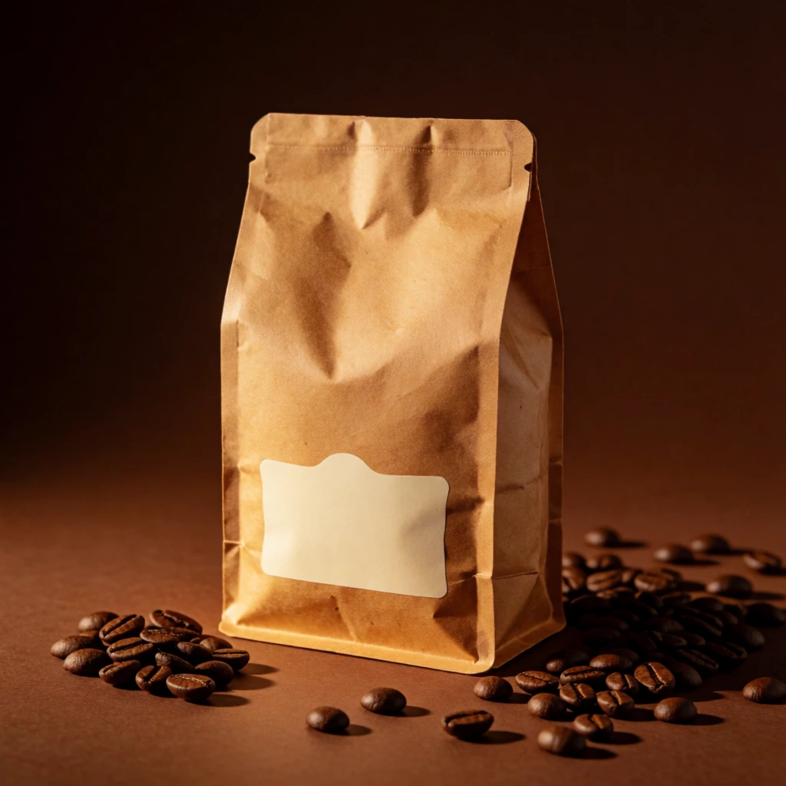
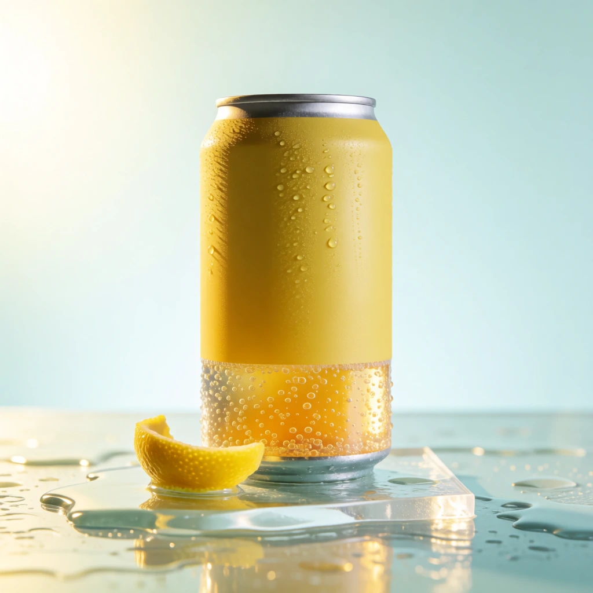
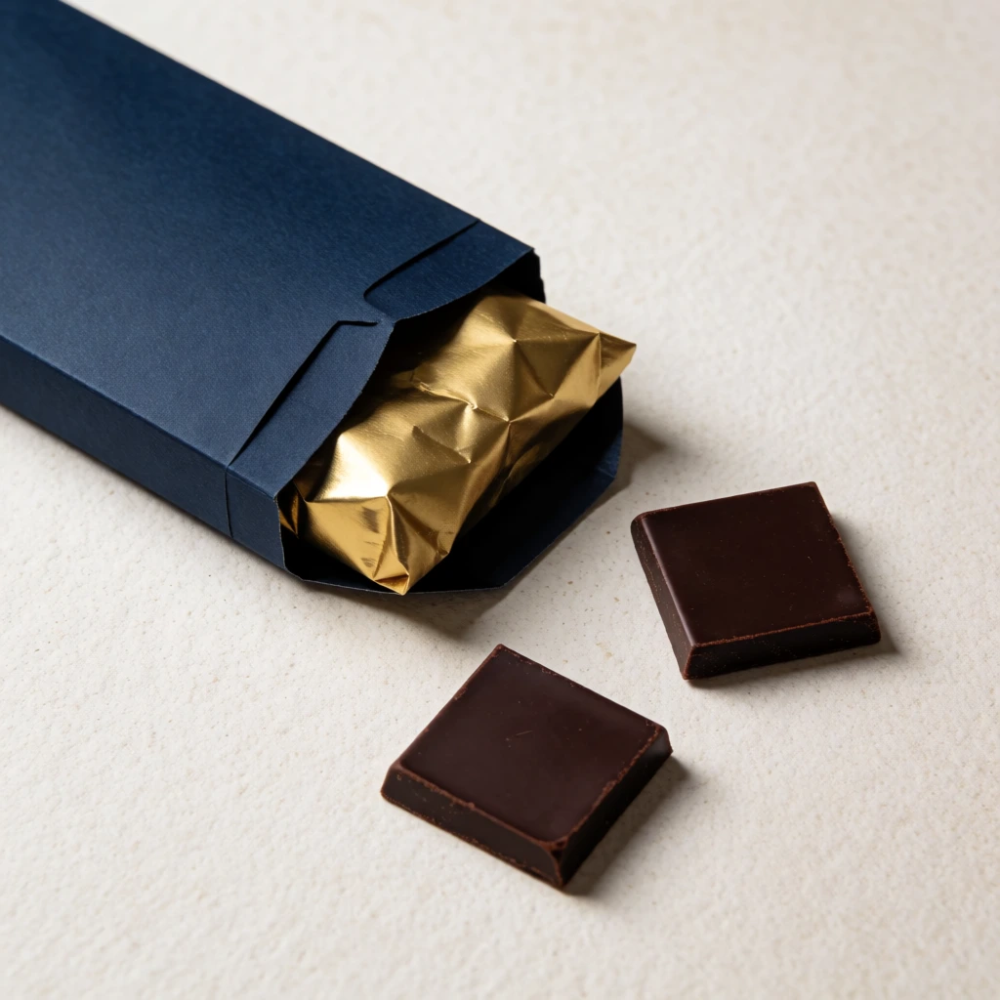
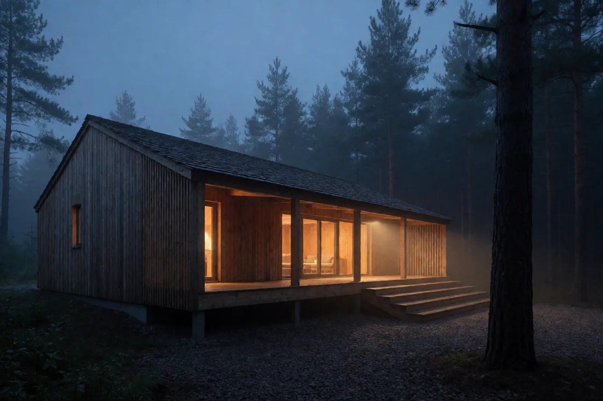
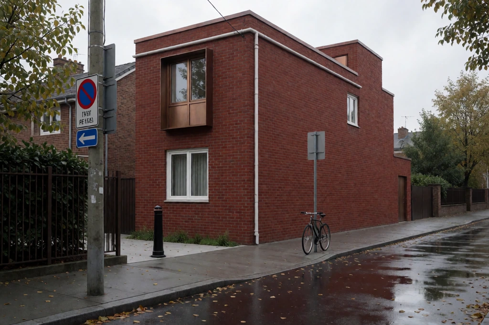
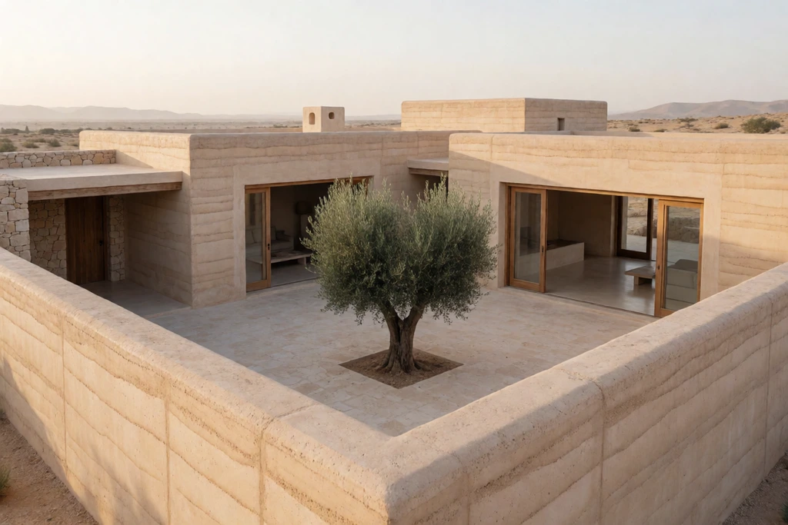

[← the categories](gallery.md)
## weave

_A controlled experiment: rope and chain from separable to fully interpenetrating, one surface and one light throughout_

### 1. Weave: three separate ropes


```text
Three separate lengths of natural hemp rope lying parallel and not touching on a plain grey concrete surface, shot from directly above under soft even light. Fibre twist clearly visible on each. Nothing else in frame.
```

`seed: 806878733` · `weave-1`

<sub>vocabulary: `soft even light` · [what each one does](../VOCABULARY.md)</sub>

<sub>[back to the categories](gallery.md#categories)</sub>

### 2. Weave: two ropes crossing


```text
Two lengths of natural hemp rope crossing over each other in a simple X on a plain grey concrete surface, shot from directly above under soft even light. Fibre twist clearly visible, one rope plainly lying on top of the other. Nothing else in frame.
```

`seed: 1857044032` · `weave-2`

<sub>vocabulary: `soft even light` · [what each one does](../VOCABULARY.md)</sub>

<sub>[back to the categories](gallery.md#categories)</sub>

### 3. Weave: overhand knot


```text
A single overhand knot tied loosely in a length of natural hemp rope on a plain grey concrete surface, shot from directly above under soft even light. The rope passes through its own loop once. Fibre twist clearly visible. Nothing else in frame.
```

`seed: 620932301` · `weave-3`

<sub>vocabulary: `soft even light` · [what each one does](../VOCABULARY.md)</sub>

<sub>[back to the categories](gallery.md#categories)</sub>

### 4. Weave: two chain links


```text
Exactly 2 steel chain links interlocked with each other, lying on a plain grey concrete surface, shot from directly above under soft even light. Each link a closed oval of round bar, one passing through the other. Nothing else in frame.
```

`seed: 728314033` · `weave-5`

<sub>vocabulary: `soft even light` · [what each one does](../VOCABULARY.md)</sub>

<sub>[back to the categories](gallery.md#categories)</sub>

### 5. Weave: a length of chain


```text
A short length of heavy steel chain lying in a loose S on a plain grey concrete surface, shot from directly above under soft even light. Every link a closed oval of round bar passing through its two neighbours. Nothing else in frame.
```

`seed: 488066171` · `weave-6`

<sub>vocabulary: `soft even light` · [what each one does](../VOCABULARY.md)</sub>

<sub>[back to the categories](gallery.md#categories)</sub>

### 6. Weave: basket wall


```text
A close view of the woven wall of a willow basket, the horizontal weavers passing alternately in front of and behind the vertical stakes. Soft even light, shot square on, the weave filling the frame. Nothing else visible.
```

`seed: 1404524049` · `weave-7`

<sub>vocabulary: `soft even light` · [what each one does](../VOCABULARY.md)</sub>

<sub>[back to the categories](gallery.md#categories)</sub>

### 7. Weave: drawn knotwork


```text
A drawn Celtic knotwork panel in black ink on cream paper: a single continuous interlaced band that passes alternately over and under itself throughout, no breaks, no colour, no border decoration. Flat, straight on, filling the frame.
```

`seed: 1984874786` · `weave-8`

<sub>[back to the categories](gallery.md#categories)</sub>

## tattoo

_Flash sheets and applied work_

### 1. American traditional flash sheet


```text
An American traditional tattoo flash sheet on aged paper: a swallow, an anchor, a dagger and a rose arranged with space between them, bold black outlines, limited flat colour in red, green and yellow. No text, no border.
```

`seed: 1798763568` · `tattoo-001`

<sub>[back to the categories](gallery.md#categories)</sub>

### 2. Fine-line botanical, forearm


```text
A fine-line botanical tattoo on a forearm, single-weight black line with no shading, a sprig of yarrow following the muscle. Skin slightly reddened around the fresh work, natural window light, the rest of the arm out of focus.
```

`seed: 586501771` · `tattoo-002`

<sub>vocabulary: `window light` · [what each one does](../VOCABULARY.md)</sub>

<sub>[back to the categories](gallery.md#categories)</sub>

### 3. Japanese sleeve, wave and koi


```text
A Japanese-style tattoo sleeve photographed on an upper arm: a koi against stylised wave patterns, bold black linework with grey wash and limited colour, the background waves flowing around the muscle. Studio light, plain backdrop.
```

`seed: 1099487398` · `tattoo-003`

<sub>[back to the categories](gallery.md#categories)</sub>

### 4. Blackwork geometric


```text
A blackwork geometric tattoo on a calf: dense solid black shapes with negative-space skin lines between them, sharp edges, no grey and no colour. Raking light so the fresh ink sits slightly proud. Plain background.
```

`seed: 472089204` · `tattoo-004`

<sub>vocabulary: `raking light` · [what each one does](../VOCABULARY.md)</sub>

<sub>[back to the categories](gallery.md#categories)</sub>

### 5. Stick and poke, small


```text
A small hand-poked tattoo on the inside of a wrist: a simple crescent moon in slightly uneven dots, the line wobbling where the hand moved. Macro, natural light, skin texture and fine hairs visible.
```

`seed: 445435906` · `tattoo-005`

<sub>vocabulary: `macro` · [what each one does](../VOCABULARY.md)</sub>

<sub>[back to the categories](gallery.md#categories)</sub>

### 6. Woodcut-style raven


```text
A woodcut-style tattoo of a raven on a shoulder blade, heavy parallel hatching for the shading and bold contour lines, no grey wash, no colour. Soft directional light, the shoulder turned away from camera.
```

`seed: 708038755` · `tattoo-006`

<sub>vocabulary: `directional light` · [what each one does](../VOCABULARY.md)</sub>

<sub>[back to the categories](gallery.md#categories)</sub>

### 7. Flash sheet, ocean set


```text
A tattoo flash sheet of ocean motifs on off-white paper: a lighthouse, a whale tail, a compass rose and a knotted rope, evenly spaced, bold outlines with muted flat colour. No text anywhere on the sheet.
```

`seed: 943002415` · `tattoo-007`

<sub>vocabulary: `muted` · [what each one does](../VOCABULARY.md)</sub>

<sub>[back to the categories](gallery.md#categories)</sub>

## pixel-art

_Low-resolution sprite and tile work_

### 1. Pixel tileset, dungeon


```text
A pixel-art tileset for a dungeon: stone floor, wall, door and stair tiles laid out in a grid, hard-edged pixels with no anti-aliasing, a limited palette of about sixteen colours. Chunky and readable at small size. No text.
```

`seed: 808571885` · `pixel-art-001`

<sub>vocabulary: `limited palette` · [what each one does](../VOCABULARY.md)</sub>

<sub>[back to the categories](gallery.md#categories)</sub>

### 2. Isometric pixel room


```text
An isometric pixel-art room: a desk, a bed, a rug and a window, drawn on a strict 2:1 isometric grid with hard pixel edges and dithered shading. Muted palette, no anti-aliasing, no text.
```

`seed: 1079501690` · `pixel-art-003`

<sub>vocabulary: `isometric`, `muted palette` · [what each one does](../VOCABULARY.md)</sub>

<sub>[back to the categories](gallery.md#categories)</sub>

### 3. Pixel landscape, parallax


```text
A pixel-art side-scrolling landscape with three depth layers: dark foreground trees, mid-ground hills, pale distant mountains, each flatter and lighter than the last. Hard pixel edges, dithered skies, limited palette.
```

`seed: 1194676723` · `pixel-art-004`

<sub>vocabulary: `limited palette` · [what each one does](../VOCABULARY.md)</sub>

<sub>[back to the categories](gallery.md#categories)</sub>

### 4. Pixel food icons


```text
A grid of sixteen pixel-art food icons — bread, fish, apple, cheese and so on — each drawn in a small square cell with hard pixel edges, black outlines and a limited palette. Even spacing, plain background, no text.
```

`seed: 25307749` · `pixel-art-005`

<sub>vocabulary: `limited palette` · [what each one does](../VOCABULARY.md)</sub>

<sub>[back to the categories](gallery.md#categories)</sub>

### 5. Dithered gradient sky


```text
A pixel-art sunset sky rendered entirely with ordered dithering between four colours, the dither pattern clearly visible as alternating pixels, a flat black horizon line across the lower third. No smooth gradients anywhere.
```

`seed: 1733307886` · `pixel-art-006`

<sub>[back to the categories](gallery.md#categories)</sub>

### 6. Pixel portrait, 32x32 feel


```text
A pixel-art portrait bust at very low resolution, perhaps thirty-two pixels across, so each pixel is a large visible square. Limited palette, hard edges, readable features built from very few pixels. Plain background.
```

`seed: 324325015` · `pixel-art-007`

<sub>vocabulary: `limited palette` · [what each one does](../VOCABULARY.md)</sub>

<sub>[back to the categories](gallery.md#categories)</sub>

### 7. Pixel shop interface


```text
A pixel-art game shop interface: a bordered panel with item slots in a grid, a coin icon and a scroll bar, drawn with hard pixel edges and a limited palette. The panel border built from repeated corner and edge tiles. No text.
```

`seed: 1430458668` · `pixel-art-008`

<sub>vocabulary: `limited palette` · [what each one does](../VOCABULARY.md)</sub>

<sub>[back to the categories](gallery.md#categories)</sub>

## anatomy

_Medical and natural-history illustration of bodies_

### 1. Engraved skeleton plate


```text
A 19th-century engraved anatomical plate of a human hand skeleton, fine line and stipple shading, bones separated slightly to show the joints, aged paper with a visible plate mark. No labels, no numbers.
```

`seed: 872437719` · `anatomy-001`

<sub>vocabulary: `engraved` · [what each one does](../VOCABULARY.md)</sub>

<sub>[back to the categories](gallery.md#categories)</sub>

### 2. Muscle study, red chalk


```text
An anatomical muscle study of a shoulder and upper arm drawn in red chalk on toned paper, fibres of each muscle group indicated by direction of stroke, white chalk for the highlights. Renaissance drawing, no labels.
```

`seed: 118298043` · `anatomy-002`

<sub>[back to the categories](gallery.md#categories)</sub>

### 3. Comparative bird wings


```text
A natural-history plate comparing four bird wings side by side, each drawn with the feathers laid out and the bone structure faintly indicated beneath, fine ink line with light watercolour. Cream paper, no captions.
```

`seed: 1996241764` · `anatomy-003`

<sub>vocabulary: `watercolour` · [what each one does](../VOCABULARY.md)</sub>

<sub>[back to the categories](gallery.md#categories)</sub>

### 4. Cross-section, tree trunk


```text
A botanical cross-section of a tree trunk drawn as a scientific illustration: bark, phloem, cambium, sapwood and heartwood as concentric zones with different hatching densities, one ray running outward. Ink on white, no labels.
```

`seed: 715025422` · `anatomy-004`

<sub>[back to the categories](gallery.md#categories)</sub>

### 5. Insect morphology plate


```text
A morphological plate of a beetle: dorsal view, ventral view and a detached leg and antenna drawn separately below, fine stipple shading, scientific precision. Ink on cream paper, no labels, no scale bar.
```

`seed: 1344360601` · `anatomy-005`

<sub>[back to the categories](gallery.md#categories)</sub>

### 6. Écorché figure study


```text
An écorché study: a standing human figure with the skin removed to show the superficial musculature, drawn in graphite with careful modelling, three-quarter view against blank paper. Academic drawing, no labels.
```

`seed: 1451225607` · `anatomy-006`

<sub>vocabulary: `three-quarter` · [what each one does](../VOCABULARY.md)</sub>

<sub>[back to the categories](gallery.md#categories)</sub>

### 7. Heart, wax model photograph


```text
A photograph of an antique anatomical wax model of a human heart on a wooden stand, the wax yellowed and slightly crazed with age, vessels painted in faded red and blue. Museum lighting, dark background, no signage.
```

`seed: 1466015518` · `anatomy-007`

<sub>[back to the categories](gallery.md#categories)</sub>

### 8. Fish skeleton, prepared


```text
A prepared fish skeleton mounted flat on a pale board, every rib and fin ray intact, photographed straight down under even light. The bones dry and slightly translucent. Museum specimen framing, no labels.
```

`seed: 521991243` · `anatomy-008`

<sub>vocabulary: `even light`, `straight down` · [what each one does](../VOCABULARY.md)</sub>

<sub>[back to the categories](gallery.md#categories)</sub>

## sculpture

_Carved, cast and modelled form_

### 1. Marble drapery, close


```text
A close view of carved marble drapery falling over a knee, the folds undercut so they cast their own shadows, chisel marks visible in the deeper recesses. Raking light, plain dark background, no face in frame.
```

`seed: 374186321` · `sculpture-001`

<sub>vocabulary: `raking light` · [what each one does](../VOCABULARY.md)</sub>

<sub>[back to the categories](gallery.md#categories)</sub>

### 2. Bronze patina, weathered


```text
A weathered outdoor bronze sculpture photographed close: green and brown patina streaked by rain, the high points rubbed back to metal by hands. Overcast light, the form abstract enough that no subject reads. Shallow focus.
```

`seed: 735427878` · `sculpture-002`

<sub>vocabulary: `overcast light`, `patina`, `shallow focus`, `weathered` · [what each one does](../VOCABULARY.md)</sub>

<sub>[back to the categories](gallery.md#categories)</sub>

### 3. Clay maquette on a turntable


```text
An unfired clay maquette of a seated figure on a sculptor's turntable, tool marks and thumbprints all over the surface, an armature wire visible at one ankle. Studio light, plain wall, work in progress rather than finished.
```

`seed: 1128908131` · `sculpture-003`

<sub>[back to the categories](gallery.md#categories)</sub>

### 4. Carved stone lettering


```text
Letters cut into a slate slab reading exactly "IN MEMORIAM" in a chiselled Roman capital, V-cut so each stroke catches light on one side and shadow on the other. Raking light, straight on, nothing else on the slab.
```

`seed: 361575210` · `sculpture-004`

<sub>vocabulary: `raking light` · [what each one does](../VOCABULARY.md)</sub>

<sub>[back to the categories](gallery.md#categories)</sub>

### 5. Welded steel assembly


```text
An abstract welded steel sculpture in a yard, plate and box section joined with visible weld beads left unground, surface rusted to an even orange. Flat overcast light, grass at the base, no plinth.
```

`seed: 1421146345` · `sculpture-005`

<sub>vocabulary: `overcast light` · [what each one does](../VOCABULARY.md)</sub>

<sub>[back to the categories](gallery.md#categories)</sub>

### 6. Plaster cast, chipped


```text
A plaster cast of a classical torso in a drawing studio, chipped at one shoulder and grey with age and dust, lit by a single high window. Cream plaster against a dark wall, easels out of focus behind.
```

`seed: 1371886322` · `sculpture-006`

<sub>[back to the categories](gallery.md#categories)</sub>

### 7. Wood carving, gouge marks


```text
A carved wooden form showing deliberate gouge facets across the whole surface, no sanding, the grain running diagonally through the cuts. Warm side light so every facet reads. Plain background, no subject that resolves.
```

`seed: 7962539` · `sculpture-007`

<sub>vocabulary: `grain`, `warm side` · [what each one does](../VOCABULARY.md)</sub>

<sub>[back to the categories](gallery.md#categories)</sub>

### 8. Kinetic mobile, hanging


```text
A hanging kinetic mobile of painted metal shapes on fine wires, balanced at several levels, photographed against a plain white wall so the shapes and their shadows overlap. Soft light, slight motion blur on the lowest element.
```

`seed: 1946227466` · `sculpture-008`

<sub>[back to the categories](gallery.md#categories)</sub>

## plant

_Houseplants and cultivated growth_

### 1. Monstera against a wall


```text
A mature monstera in a terracotta pot against a plain plaster wall, hard afternoon side light throwing the leaf fenestrations as sharp shadows on the plaster. A few brown leaf tips left in. Straight on, no styling.
```

`seed: 1052177918` · `plant-001`

<sub>vocabulary: `side light` · [what each one does](../VOCABULARY.md)</sub>

<sub>[back to the categories](gallery.md#categories)</sub>

### 2. Fern in a cold frame


```text
A hart's tongue fern growing in a cold frame, condensation on the glass above it diffusing the light, dead leaves and grit around the crown. Damp, green, no sun. Shot low through the open frame.
```

`seed: 1833217793` · `plant-002`

<sub>[back to the categories](gallery.md#categories)</sub>

### 3. Seedlings under a window


```text
A tray of tomato seedlings on a windowsill leaning toward the light, some leggy, a hand-written wooden label pushed into the compost with no legible writing on it. Soft window light, condensation on the glass.
```

`seed: 104532641` · `plant-003`

<sub>vocabulary: `window light` · [what each one does](../VOCABULARY.md)</sub>

<sub>[back to the categories](gallery.md#categories)</sub>

### 4. Bark and lichen, close


```text
Close view of an old oak trunk with lichen and moss in the fissures, damp after rain so the colours are saturated, a single fern growing out of a crack. Soft woodland light, shallow focus falling off around the fern.
```

`seed: 27024972` · `plant-004`

<sub>vocabulary: `shallow focus` · [what each one does](../VOCABULARY.md)</sub>

<sub>[back to the categories](gallery.md#categories)</sub>

### 5. Cactus collection, hard light


```text
A shelf of small cacti in matching clay pots under hard low sun, every spine casting a long fine shadow on the shelf and the wall behind. Warm colour, high contrast, straight on, nothing else in frame.
```

`seed: 264106417` · `plant-005`

<sub>vocabulary: `high contrast` · [what each one does](../VOCABULARY.md)</sub>

<sub>[back to the categories](gallery.md#categories)</sub>

### 6. Cut stems in water


```text
Cut flower stems standing in a clear glass jar of water on a windowsill, the stems refracting and offsetting at the waterline, a few bubbles clinging to them below. Backlit, cool light, plain background.
```

`seed: 1776160555` · `plant-006`

<sub>vocabulary: `backlit` · [what each one does](../VOCABULARY.md)</sub>

<sub>[back to the categories](gallery.md#categories)</sub>

### 7. Greenhouse staging


```text
Staging in a working greenhouse: trays of plants at different stages, clay pots stacked, a watering can and a trowel, algae on the glass overhead. Humid diffused light, everything used, nobody present.
```

`seed: 1944966882` · `plant-007`

<sub>vocabulary: `overhead` · [what each one does](../VOCABULARY.md)</sub>

<sub>[back to the categories](gallery.md#categories)</sub>

### 8. Ivy taking a wall


```text
Ivy climbing a brick wall, the aerial roots gripping the mortar, older growth woody at the base and new leaves pale at the tips. Flat overcast light, straight on, the wall filling the frame.
```

`seed: 1981899165` · `plant-008`

<sub>vocabulary: `overcast light` · [what each one does](../VOCABULARY.md)</sub>

<sub>[back to the categories](gallery.md#categories)</sub>

### 9. Bulbs forced in glass


```text
Hyacinth bulbs forced in clear glass vases so the white roots fill the water below and the shoots rise above, three of them in a row on a windowsill. Backlit, the roots sharply defined, cool winter light.
```

`seed: 1137985015` · `plant-009`

<sub>vocabulary: `backlit` · [what each one does](../VOCABULARY.md)</sub>

<sub>[back to the categories](gallery.md#categories)</sub>

### 10. Fallen leaves, wet path


```text
Fallen leaves plastered to a wet path, each one darkened and stuck flat, colours ranging from ochre to near black, a few still holding their shape above the rest. Straight down, flat overcast light, no horizon.
```

`seed: 1166752125` · `plant-010`

<sub>vocabulary: `overcast light`, `straight down` · [what each one does](../VOCABULARY.md)</sub>

<sub>[back to the categories](gallery.md#categories)</sub>

## tool

_Hand tools and workshop equipment_

### 1. Plane on a bench


```text
A wooden-bodied hand plane resting on its side on a workbench beside a curl of shaving, the sole polished bright by use and the body darkened by handling. Warm side light, sawdust in the bench grain.
```

`seed: 2687447` · `tool-001`

<sub>vocabulary: `grain`, `polished`, `warm side` · [what each one does](../VOCABULARY.md)</sub>

<sub>[back to the categories](gallery.md#categories)</sub>

### 2. Anvil and hammers


```text
A blacksmith's anvil with three hammers of different weights resting on and around it, scale and soot on the face, the horn worn bright. Dim forge interior with one window, warm light from the left.
```

`seed: 1451291682` · `tool-002`

<sub>vocabulary: `warm light`, `worn` · [what each one does](../VOCABULARY.md)</sub>

<sub>[back to the categories](gallery.md#categories)</sub>

### 3. Socket set, open case


```text
An open socket set case shot from directly above, sockets seated in their moulded tray in ascending size, a few missing from their slots, oil marks on the foam. Even workshop light, no legible markings.
```

`seed: 204857629` · `tool-003`

<sub>[back to the categories](gallery.md#categories)</sub>

### 4. Sharpening stone and knife


```text
A water stone on a wooden base with a kitchen knife laid across it, slurry pooled at one end, the stone dished slightly from years of use. Soft directional light, macro, the bevel catching a highlight.
```

`seed: 219309586` · `tool-004`

<sub>vocabulary: `directional light`, `macro` · [what each one does](../VOCABULARY.md)</sub>

<sub>[back to the categories](gallery.md#categories)</sub>

### 5. Bench vice, worn jaws


```text
A heavy engineer's bench vice bolted to a scarred workbench, the jaw faces chipped and the paint worn through on the handle. Overcast light from a workshop window, metal filings on the bench around it.
```

`seed: 1781327008` · `tool-005`

<sub>vocabulary: `overcast light`, `worn` · [what each one does](../VOCABULARY.md)</sub>

<sub>[back to the categories](gallery.md#categories)</sub>

### 6. Chisels in a roll


```text
A canvas tool roll opened flat with six chisels in their pockets, handles worn smooth, edges bright where they have been honed. Shot from directly above, soft even light, the canvas stained with oil.
```

`seed: 784598398` · `tool-006`

<sub>vocabulary: `soft even light`, `worn` · [what each one does](../VOCABULARY.md)</sub>

<sub>[back to the categories](gallery.md#categories)</sub>

### 7. Wrench on a nut, greasy


```text
An open-ended wrench engaged on a rusted nut, grease on the jaws and the thread, the metal around it scarred from previous attempts. Macro, hard raking light, shallow focus. No hands in frame.
```

`seed: 1661979018` · `tool-007`

<sub>vocabulary: `macro`, `raking light`, `shallow focus` · [what each one does](../VOCABULARY.md)</sub>

<sub>[back to the categories](gallery.md#categories)</sub>

### 8. Soldering station, close


```text
A soldering iron in its stand beside a coil of solder and a small circuit board, flux residue on the board, the tip tinned and slightly oxidised. Warm bench light, macro, shallow focus. No hands in frame.
```

`seed: 924155302` · `tool-008`

<sub>vocabulary: `macro`, `shallow focus` · [what each one does](../VOCABULARY.md)</sub>

<sub>[back to the categories](gallery.md#categories)</sub>

## knolling

_Objects arranged flat and square to the frame_

### 1. Baking equipment


```text
Baking equipment arranged flat and square on a marble surface: scales, a scraper, a whisk, two tins and a folded cloth, plus small bowls of flour and salt. Aligned to a grid with even spacing, shot straight down.
```

`seed: 251379512` · `knolling-003`

<sub>vocabulary: `straight down` · [what each one does](../VOCABULARY.md)</sub>

<sub>[back to the categories](gallery.md#categories)</sub>

### 2. Sewing kit


```text
A sewing kit arranged flat on linen: scissors, a tape measure coiled, thread spools in a row, pins in a cushion, a thimble and a seam ripper. Square to the frame, even gaps, shot straight down under soft light.
```

`seed: 1903543889` · `knolling-005`

<sub>vocabulary: `straight down` · [what each one does](../VOCABULARY.md)</sub>

<sub>[back to the categories](gallery.md#categories)</sub>

### 3. Fishing tackle


```text
Fishing tackle knolled on weathered wood: a reel, spools of line, a small box of flies, forceps, floats in a row and a folded net. Aligned to a grid, even spacing, straight down, flat overcast light.
```

`seed: 127924666` · `knolling-006`

<sub>vocabulary: `overcast light`, `straight down`, `weathered` · [what each one does](../VOCABULARY.md)</sub>

<sub>[back to the categories](gallery.md#categories)</sub>

### 4. Desk drawer, emptied


```text
The contents of a desk drawer laid out flat and square on the desk itself: pencils in a row, a stapler, paperclips grouped, an eraser, a ruler and a roll of tape. Even gaps, shot straight down, cool north light.
```

`seed: 1338922538` · `knolling-007`

<sub>vocabulary: `straight down` · [what each one does](../VOCABULARY.md)</sub>

<sub>[back to the categories](gallery.md#categories)</sub>

### 5. Coffee kit


```text
Coffee-making equipment knolled on a concrete surface: a grinder, a dripper, filters fanned slightly, a scale, a kettle and a cup, arranged on a grid with even spacing. Straight down, soft even light, no beans spilled.
```

`seed: 793490821` · `knolling-008`

<sub>vocabulary: `soft even light`, `straight down` · [what each one does](../VOCABULARY.md)</sub>

<sub>[back to the categories](gallery.md#categories)</sub>

## silhouette

_Subjects reduced to shape against light_

### 1. Figure in a doorway


```text
A figure standing in a bright doorway seen from inside a dark room, exposed for the doorway so the figure and the frame read as clean black shapes against white. No detail in the shadow at all. Straight on, symmetrical.
```

`seed: 809416368` · `silhouette-001`

<sub>vocabulary: `symmetrical` · [what each one does](../VOCABULARY.md)</sub>

<sub>[back to the categories](gallery.md#categories)</sub>

### 2. Trees against fog


```text
Bare trees receding into fog, the nearest almost black and each rank behind it paler, so the image reads as flat layered shapes rather than depth. No sky detail, no ground detail, no colour.
```

`seed: 2025912881` · `silhouette-002`

<sub>[back to the categories](gallery.md#categories)</sub>

### 3. Crane against sunset


```text
A construction crane in full silhouette against a graded orange and violet sky, every strut and cable reading as a black line. No detail in the crane, no foreground, the sky perfectly smooth.
```

`seed: 1093323322` · `silhouette-003`

<sub>vocabulary: `silhouette` · [what each one does](../VOCABULARY.md)</sub>

<sub>[back to the categories](gallery.md#categories)</sub>

### 4. Cyclist on a ridge


```text
A cyclist crossing a ridge line in silhouette against a pale overcast sky, the bicycle's frame and wheels reading as line and the rider as a solid shape. Wide, the ridge as a simple curve across the lower frame.
```

`seed: 2075454854` · `silhouette-005`

<sub>vocabulary: `silhouette` · [what each one does](../VOCABULARY.md)</sub>

<sub>[back to the categories](gallery.md#categories)</sub>

### 5. Bottles on a sill


```text
A row of glass bottles on a windowsill photographed against the bright window, their profiles reading as dark outlines with light passing through the glass so the necks glow. Nothing else in frame, no colour.
```

`seed: 763629602` · `silhouette-006`

<sub>[back to the categories](gallery.md#categories)</sub>

### 6. Birds on a wire


```text
Birds spaced along a wire in silhouette against a flat overcast sky, each one a small solid shape, the wire a thin line sagging between two poles out of frame. Minimal, high key, no other detail.
```

`seed: 1599517231` · `silhouette-007`

<sub>vocabulary: `silhouette` · [what each one does](../VOCABULARY.md)</sub>

<sub>[back to the categories](gallery.md#categories)</sub>

### 7. Ferns backlit to black


```text
Fern fronds photographed against a bright sky and exposed so they render as black lacework, every pinna separate and readable as shape. No green, no sky detail, the pattern filling the frame.
```

`seed: 239403001` · `silhouette-008`

<sub>[back to the categories](gallery.md#categories)</sub>

## mirror

_Reflections and what they get right_

### 1. Still lake, whole reflection


```text
A mountain reflected in perfectly still water at dawn, the reflection nearly complete with only a faint break where a current passes. Shot so the waterline sits exactly across the middle of the frame. Muted cold light.
```

`seed: 1857318294` · `mirror-001`

<sub>vocabulary: `muted` · [what each one does](../VOCABULARY.md)</sub>

<sub>[back to the categories](gallery.md#categories)</sub>

### 2. Shop window, two worlds


```text
A shop window at dusk in which the lit interior and the reflected street overlap at similar brightness, so both read at once. Parked cars reflected across a display. Nobody identifiable, no legible signage.
```

`seed: 89009176` · `mirror-002`

<sub>[back to the categories](gallery.md#categories)</sub>

### 3. Wet pavement after rain


```text
A wet pavement after rain reflecting a row of buildings and a lamp, the reflection broken where the surface is textured and sharp where a puddle is still. Shot low, the puddle occupying the lower half. Night, warm lights.
```

`seed: 1764404241` · `mirror-003`

<sub>vocabulary: `warm light` · [what each one does](../VOCABULARY.md)</sub>

<sub>[back to the categories](gallery.md#categories)</sub>

### 4. Car wing mirror


```text
A car wing mirror in close view reflecting a road receding behind, the mirror housing sharp and the reflected scene slightly compressed by the convex curve. Rain beading on the housing. Overcast, no legible text.
```

`seed: 286347384` · `mirror-005`

<sub>[back to the categories](gallery.md#categories)</sub>

### 5. Facing mirrors, corridor


```text
Two mirrors facing each other on opposite walls of a plain corridor, producing a receding corridor of reflections that gets dimmer and greener with each bounce. Nobody in frame. Even artificial light.
```

`seed: 1877205886` · `mirror-006`

<sub>[back to the categories](gallery.md#categories)</sub>

### 6. Polished steel counter


```text
A polished stainless steel counter reflecting an overhead ceiling and a row of hanging pans, the reflection softened and slightly distorted by the brushed grain. Shot at a low angle, kitchen light, nobody present.
```

`seed: 371991096` · `mirror-007`

<sub>vocabulary: `grain`, `low angle`, `overhead`, `polished` · [what each one does](../VOCABULARY.md)</sub>

<sub>[back to the categories](gallery.md#categories)</sub>

### 7. Puddle upside down


```text
A single puddle on tarmac photographed so tightly that only the reflected sky and building fill the frame, with a rim of wet asphalt at the very edge. The image reads inverted until you find the edge. Overcast.
```

`seed: 469746667` · `mirror-008`

<sub>[back to the categories](gallery.md#categories)</sub>

## mineral

_Crystals, ores and cut stone_

### 1. Amethyst geode, split


```text
A split amethyst geode photographed against black, the crystal-lined cavity catching a single light so the points glitter while the rough outer rind stays dark. Macro, deep purple grading to near clear at the tips.
```

`seed: 1645708822` · `mineral-001`

<sub>vocabulary: `macro`, `single light` · [what each one does](../VOCABULARY.md)</sub>

<sub>[back to the categories](gallery.md#categories)</sub>

### 2. Pyrite cubes in matrix


```text
Natural pyrite cubes embedded in a grey rock matrix, the metallic faces striated and catching hard light, the matrix dull around them. Macro, dark background, the cubes at slightly different angles.
```

`seed: 361333150` · `mineral-002`

<sub>vocabulary: `hard light`, `macro` · [what each one does](../VOCABULARY.md)</sub>

<sub>[back to the categories](gallery.md#categories)</sub>

### 3. Malachite, banded


```text
A polished slice of banded malachite filling the frame, concentric green bands of varying tone and width, the polish showing a soft sheen. Even light, no edges of the slice visible, almost abstract.
```

`seed: 1587099661` · `mineral-003`

<sub>vocabulary: `even light`, `polished` · [what each one does](../VOCABULARY.md)</sub>

<sub>[back to the categories](gallery.md#categories)</sub>

### 4. Quartz point, backlit


```text
A single clear quartz point backlit against black so the internal fractures and a small inclusion read as bright planes inside the stone. Macro, the termination sharp, the base rough where it broke from the matrix.
```

`seed: 1821760512` · `mineral-004`

<sub>vocabulary: `backlit`, `macro` · [what each one does](../VOCABULARY.md)</sub>

<sub>[back to the categories](gallery.md#categories)</sub>

### 5. Meteorite, etched


```text
A cut and acid-etched iron meteorite slice showing the crystalline Widmanstätten pattern as interlocking bands, the surface faintly reflective. Macro, raking light, dark background, no scale reference.
```

`seed: 1107576610` · `mineral-005`

<sub>vocabulary: `macro`, `raking light` · [what each one does](../VOCABULARY.md)</sub>

<sub>[back to the categories](gallery.md#categories)</sub>

### 6. Rough opal in host rock


```text
Rough precious opal still in its ironstone host, a seam of colour play flashing green and orange along one edge while the rest stays dull brown. Macro, one hard light moved to catch the fire.
```

`seed: 1732379579` · `mineral-006`

<sub>vocabulary: `hard light`, `macro` · [what each one does](../VOCABULARY.md)</sub>

<sub>[back to the categories](gallery.md#categories)</sub>

### 7. Salt crystals growing


```text
Halite crystals grown on a string in a jar, cubic and stepped, cloudy at the centre and clearer at the faces, still wet from the solution. Backlit, macro, the string just visible through them.
```

`seed: 1046939819` · `mineral-007`

<sub>vocabulary: `backlit`, `macro` · [what each one does](../VOCABULARY.md)</sub>

<sub>[back to the categories](gallery.md#categories)</sub>

### 8. Slate with pyrite bloom


```text
A split slab of dark slate with a bloom of small brassy pyrite crystals scattered across the bedding plane, the slate matte and the pyrite bright. Raking light, shot straight down, no edges of the slab.
```

`seed: 1654852533` · `mineral-008`

<sub>vocabulary: `matte`, `raking light`, `straight down` · [what each one does](../VOCABULARY.md)</sub>

<sub>[back to the categories](gallery.md#categories)</sub>

## seasonal

_Weather-marked moments in the year_

### 1. First frost on a gate


```text
The first hard frost of the year on a wooden field gate, crystals picked out along the top rail and the hinge, the field beyond still green and unfrosted where the sun has reached. Low morning light, cold blue shadows.
```

`seed: 4600144` · `seasonal-001`

<sub>[back to the categories](gallery.md#categories)</sub>

### 2. Blossom on wet tarmac


```text
Fallen cherry blossom stuck to wet tarmac after rain, drifted along the kerb line, a few petals still falling and blurred. Shot straight down, flat grey light, the pink against the dark road.
```

`seed: 796042065` · `seasonal-002`

<sub>vocabulary: `straight down` · [what each one does](../VOCABULARY.md)</sub>

<sub>[back to the categories](gallery.md#categories)</sub>

### 3. Hay meadow, midsummer


```text
A hay meadow at midsummer just before cutting, grasses and seed heads at chest height moving in wind, a hard blue sky above. Shot from inside the crop looking up and out, strong sun, deep shadows between stems.
```

`seed: 1484674026` · `seasonal-003`

<sub>[back to the categories](gallery.md#categories)</sub>

### 4. Bonfire smoke at dusk


```text
Smoke from an allotment bonfire hanging low in still autumn air at dusk, the last light catching it from the side, bare fruit trees behind. Nobody present, warm grey palette, everything damp.
```

`seed: 220422761` · `seasonal-004`

<sub>vocabulary: `palette`, `warm grey` · [what each one does](../VOCABULARY.md)</sub>

<sub>[back to the categories](gallery.md#categories)</sub>

### 5. Snow on a car roof


```text
A car parked overnight under fresh snow, an even blanket on the roof and bonnet with the shape of the vehicle still readable beneath, one wiper standing proud. Flat morning light, an untouched street behind.
```

`seed: 32247102` · `seasonal-005`

<sub>[back to the categories](gallery.md#categories)</sub>

### 6. Rockpool at low spring tide


```text
A rockpool exposed at the lowest spring tide, weed collapsed on the rock around it, anemones closed, the water absolutely still and clear. Shot from above, overcast light, no reflections on the surface.
```

`seed: 1892545042` · `seasonal-006`

<sub>vocabulary: `overcast light` · [what each one does](../VOCABULARY.md)</sub>

<sub>[back to the categories](gallery.md#categories)</sub>

### 7. Harvest dust at evening


```text
Dust hanging over a stubble field in the last hour of light after harvesting, the low sun turning it gold, bales scattered at intervals into the distance. Long lens compression, no machinery in frame.
```

`seed: 1003507973` · `seasonal-007`

<sub>vocabulary: `long lens` · [what each one does](../VOCABULARY.md)</sub>

<sub>[back to the categories](gallery.md#categories)</sub>

### 8. Ice on a puddle, broken


```text
A thin sheet of ice over a puddle, broken through in the middle by a boot so the plates have tilted and refrozen at angles, trapped air white beneath them. Shot straight down, cold flat light, macro-ish.
```

`seed: 353654491` · `seasonal-008`

<sub>vocabulary: `flat light`, `macro`, `straight down` · [what each one does](../VOCABULARY.md)</sub>

<sub>[back to the categories](gallery.md#categories)</sub>

## packaging

_Label-free packaging studies for coffee, drinks, skincare, and gift products_

### 1. Kraft coffee bag still life



```text
Minimal specialty coffee packaging still life, one unprinted warm kraft paper bag with a small cream label shape beside scattered roasted beans, centered tabletop composition, soft window light from the left, deep brown backdrop, tactile paper fibers, modern independent roaster mood, no readable text.
```

`Krea asset: e3fe01e4-402b-4310-91dd-d56bd5f305ea` · `aspect: 1:1` · `packaging-001`

<sub>vocabulary: `window light` · [what each one does](../VOCABULARY.md)</sub>

<sub>[back to the categories](gallery.md#categories)</sub>

### 2. Citrus can on wet acrylic



```text
Cold sparkling citrus beverage can with a blank satin-yellow surface, upright on wet translucent acrylic, fresh condensation droplets and one curled lemon peel, strong golden backlight through a pale aqua background, crisp summer campaign, clean negative space, no readable text.
```

`Krea asset: 30d9edaf-455c-4cb1-9281-0d20b8273e72` · `aspect: 1:1` · `packaging-002`

<sub>[back to the categories](gallery.md#categories)</sub>

### 3. Peach skincare packaging set


```text
Skincare packaging set with one matte peach squeeze tube and one matching paper carton, both unbranded, arranged on overlapping blush-pink planes, broad softbox overhead with a narrow side shadow, front three-quarter view, refined direct-to-consumer beauty campaign, no readable text.
```

`Krea asset: d5b651dd-3a23-4113-9ac7-1c6eb9196a4a` · `aspect: 1:1` · `packaging-003`

<sub>vocabulary: `matte`, `overhead`, `three-quarter` · [what each one does](../VOCABULARY.md)</sub>

<sub>[back to the categories](gallery.md#categories)</sub>

### 4. Navy and gold chocolate wrap



```text
Artisan chocolate packaging still life, one deep navy paper sleeve and one gold-foil inner wrapper beside two dark chocolate squares, top-down composition on cream stone, warm directional light, precise paper creases and subtle metallic glints, elegant gift-ready presentation, no readable text.
```

`Krea asset: 23048f6f-bcb4-4272-b7da-c6b975c08ea7` · `aspect: 1:1` · `packaging-004`

<sub>vocabulary: `directional light`, `top-down` · [what each one does](../VOCABULARY.md)</sub>

<sub>[back to the categories](gallery.md#categories)</sub>

## architecture

_Exterior buildings and climate-responsive structures photographed in context_

### 1. Timber cabin at blue hour



```text
Contemporary timber cabin exterior beside a dark pine forest, low rectangular volume with a deep covered terrace, three-quarter view at blue hour, warm interior light through large windows, damp gravel foreground, soft mist between trees, understated architectural photography with natural material detail.
```

`Krea asset: 64fe4bf1-a10e-4157-8fa1-72b1ec151b9f` · `aspect: 3:2` · `architecture-001`

<sub>vocabulary: `three-quarter` · [what each one does](../VOCABULARY.md)</sub>

<sub>[back to the categories](gallery.md#categories)</sub>

### 2. Brick corner house after rain



```text
Compact urban brick house on a narrow corner lot, textured red masonry and recessed bronze windows, eye-level street view after rain, one bicycle for scale, overcast daylight and subtle pavement reflections, documentary architecture photography, precise geometry without dramatic distortion.
```

`Krea asset: 3a6ad346-ea10-498d-be62-aa0a3c2ad515` · `aspect: 3:2` · `architecture-002`

<sub>[back to the categories](gallery.md#categories)</sub>

### 3. Rammed-earth desert courtyard



```text
Desert courtyard house formed by low sand-colored rammed-earth walls around a single olive tree, elevated three-quarter architectural view at early morning, long restrained shadows, pale stone ground and distant arid hills, serene climate-responsive design, crisp editorial visualization with believable materials.
```

`Krea asset: 73341cdd-fd20-45c5-bbfa-936cd259eb13` · `aspect: 3:2` · `architecture-003`

<sub>vocabulary: `three-quarter` · [what each one does](../VOCABULARY.md)</sub>

<sub>[back to the categories](gallery.md#categories)</sub>
